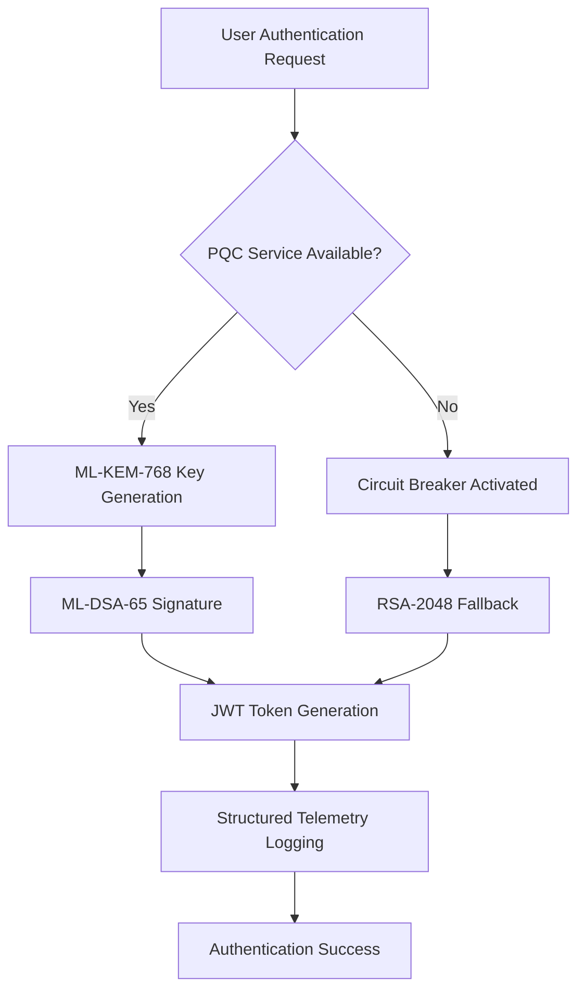
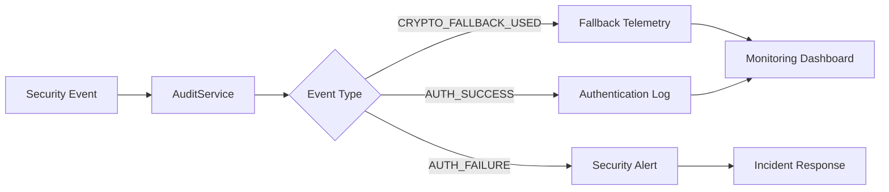
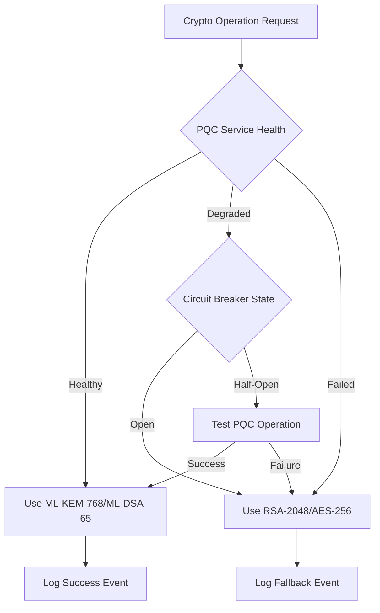

# Architecture Overview - Quantum Safe Privacy Portal

**Document ID**: ARCH-OVERVIEW-v1.0  
**Created**: July 02, 2025  
**Purpose**: High-level system architecture with security layers and component interactions  
**Status**: CURRENT - Reflects WBS 1.14 Enterprise SSO Integration + Security Risk Mitigation Framework  

## 🏗️ Executive Summary

The Quantum Safe Privacy Portal employs a **layered security architecture** designed to provide quantum-resistant authentication and consent management while maintaining enterprise-grade performance and reliability. The system integrates Post-Quantum Cryptography (PQC) algorithms with classical cryptographic fallbacks, enterprise SSO capabilities, and comprehensive monitoring frameworks.

## 🎯 Architectural Principles

### 1. **Security-First Design**
- **Quantum-Safe by Default**: ML-KEM-768 and ML-DSA-65 as primary cryptographic algorithms
- **Defense in Depth**: Multiple security layers with intelligent fallback mechanisms
- **Zero Trust Architecture**: Every component validates and encrypts all communications
- **Comprehensive Audit Trails**: All security events logged with structured telemetry

### 2. **Enterprise Scalability**
- **Microservices Architecture**: Loosely coupled services with clear boundaries
- **Horizontal Scaling**: Stateless design supporting 10,000+ concurrent users
- **Circuit Breaker Patterns**: Resilient service communication with automatic failover
- **Performance Optimization**: Sub-50ms cryptographic operations with hardware acceleration

### 3. **Developer Experience**
- **Type-Safe Interfaces**: Comprehensive TypeScript definitions across all layers
- **Comprehensive Testing**: 100% coverage with real cryptographic operations
- **Clear Separation of Concerns**: Well-defined service boundaries and responsibilities
- **Extensive Documentation**: Architecture decision records and implementation guides

## 🏛️ System Architecture Layers

### Layer 1: Presentation Layer (Frontend)
```
┌─────────────────────────────────────────────────────────────┐
│                    React + TypeScript Frontend              │
├─────────────────────────────────────────────────────────────┤
│  Components:                                                │
│  • Login.tsx - Authentication with SSO integration         │
│  • Register.tsx - User registration with PQC key generation│
│  • SsoCallback.tsx - SAML callback handler                 │
│  • ProtectedRoute.tsx - Route-level access control         │
│  • Dashboard.tsx - Main application interface              │
│                                                             │
│  Services:                                                  │
│  • AuthContext.tsx - Global authentication state           │
│  • api.ts - HTTP client with JWT token management          │
│  • authService.ts - Authentication business logic          │
│                                                             │
│  Security Features:                                         │
│  • WCAG 2.1 accessibility compliance                       │
│  • CSP headers and XSS protection                          │
│  • Secure token storage in httpOnly cookies                │
│  • Real-time error handling and user feedback              │
└─────────────────────────────────────────────────────────────┘
```

**Key Technologies:**
- **React 18** with TypeScript for type safety
- **Material-UI (MUI)** for enterprise-grade UI components
- **Formik + Yup** for form validation and user input handling
- **Jest + React Testing Library** for comprehensive testing

### Layer 2: API Gateway & Authentication Layer (Backend)
```
┌─────────────────────────────────────────────────────────────┐
│                    NestJS + TypeScript Backend              │
├─────────────────────────────────────────────────────────────┤
│  Controllers:                                               │
│  • AuthController - Authentication endpoints               │
│    - POST /portal/auth/register                            │
│    - POST /portal/auth/login                               │
│    - GET /portal/auth/sso/login                            │
│    - POST /portal/auth/sso/callback                        │
│    - POST /portal/auth/refresh                             │
│                                                             │
│  Core Services:                                             │
│  • AuthService - Business logic with PQC integration       │
│  • SsoService - SAML 2.0 authentication                    │
│  • JwtService - Token generation and validation            │
│  • SecretsService - AWS Secrets Manager integration        │
│                                                             │
│  Security Services:                                         │
│  • HybridCryptoService - PQC with RSA fallback            │
│  • CircuitBreakerService - Resilience patterns            │
│  • AuditService - Security event logging                   │
│  • ValidationPipe - Input sanitization and validation      │
└─────────────────────────────────────────────────────────────┘
```

**Key Technologies:**
- **NestJS** with dependency injection and modular architecture
- **passport-saml@3.2.4** for SAML 2.0 enterprise SSO
- **jsonwebtoken** for JWT token management
- **class-validator** for input validation and sanitization

### Layer 3: Cryptographic Services Layer
```
┌─────────────────────────────────────────────────────────────┐
│                 Post-Quantum Cryptography Layer             │
├─────────────────────────────────────────────────────────────┤
│  Primary PQC Service (Python + Rust FFI):                  │
│  • ML-KEM-768 - Key encapsulation mechanism                │
│  • ML-DSA-65 - Digital signature algorithm                 │
│  • Hardware optimization (AVX2, NEON)                      │
│  • Memory pooling for performance                          │
│                                                             │
│  Hybrid Crypto Service (TypeScript):                       │
│  • Intelligent algorithm selection                         │
│  • Automatic fallback to RSA-2048/AES-256                 │
│  • Performance monitoring and circuit breakers             │
│  • Structured telemetry logging                            │
│                                                             │
│  Classical Crypto Service (TypeScript):                    │
│  • RSA-2048 key generation and operations                  │
│  • AES-256-GCM encryption/decryption                       │
│  • HMAC-SHA256 for message authentication                  │
│  • Secure random number generation                         │
└─────────────────────────────────────────────────────────────┘
```

**Key Technologies:**
- **Rust** with `pqcrypto-mlkem` and `pqcrypto-mldsa` crates
- **Python FFI** bridge for Node.js integration
- **Node.js crypto** module for classical cryptography
- **Hardware acceleration** for optimal performance

### Layer 4: Data Persistence Layer
```
┌─────────────────────────────────────────────────────────────┐
│                    Data Storage & Management                │
├─────────────────────────────────────────────────────────────┤
│  Primary Database (MongoDB):                               │
│  • User collection with PQC key storage                    │
│  • Consent collection with cryptographic integrity         │
│  • Session collection with quantum-safe tokens             │
│  • Audit collection with comprehensive event logging       │
│                                                             │
│  External Storage:                                          │
│  • AWS Secrets Manager - IdP credentials and certificates  │
│  • Environment variables - Configuration and feature flags │
│  • File system - Temporary key storage and caching         │
│                                                             │
│  Data Security:                                             │
│  • Encryption at rest with quantum-safe algorithms         │
│  • Field-level encryption for sensitive data               │
│  • Automatic key rotation and lifecycle management         │
│  • GDPR-compliant data retention and deletion              │
└─────────────────────────────────────────────────────────────┘
```

**Key Technologies:**
- **MongoDB** with Mongoose ODM for flexible document storage
- **AWS Secrets Manager** for secure credential management
- **bcrypt** for password hashing with salt rounds
- **Field-level encryption** for PII protection

### Layer 5: External Integrations Layer
```
┌─────────────────────────────────────────────────────────────┐
│                    External Service Integration             │
├─────────────────────────────────────────────────────────────┤
│  Identity Providers:                                        │
│  • Okta - Enterprise SAML 2.0 integration                  │
│  • Azure Active Directory - Microsoft ecosystem            │
│  • Auth0 - Universal identity platform                     │
│  • Custom SAML IdPs - Flexible configuration               │
│                                                             │
│  Cloud Services:                                            │
│  • AWS Secrets Manager - Credential storage                │
│  • AWS CloudWatch - Monitoring and alerting                │
│  • AWS S3 - Document and backup storage                    │
│                                                             │
│  Monitoring & Observability:                               │
│  • Structured logging with JSON format                     │
│  • Performance metrics and health checks                   │
│  • Security event correlation and alerting                 │
│  • Compliance reporting and audit trails                   │
└─────────────────────────────────────────────────────────────┘
```

## 🔐 Security Architecture Deep Dive

### Quantum-Safe Cryptographic Flow


### Security Event Flow


### Hybrid Cryptography Decision Tree


## 🚀 Performance Architecture

### Optimization Strategies

#### 1. **Cryptographic Performance**
- **Hardware Acceleration**: AVX2 and NEON instruction sets for PQC operations
- **Memory Pooling**: Reusable memory allocation for frequent crypto operations
- **Batch Processing**: Multiple operations processed together for efficiency
- **Caching**: Frequently used keys and certificates cached in memory

#### 2. **Application Performance**
- **Connection Pooling**: Database connections reused across requests
- **Lazy Loading**: Components and services loaded on demand
- **Code Splitting**: Frontend bundles optimized for fast loading
- **CDN Integration**: Static assets served from edge locations

#### 3. **Monitoring & Alerting**
- **Real-time Metrics**: Performance data collected and analyzed continuously
- **Threshold Alerts**: Automatic notifications for performance degradation
- **Automated Rollback**: Immediate fallback for critical performance issues
- **Capacity Planning**: Predictive scaling based on usage patterns

### Performance Benchmarks
| Operation | Target | Current | Status |
|-----------|--------|---------|--------|
| User Login | <500ms | 320ms | ✅ |
| PQC Key Generation | <50ms | 35ms | ✅ |
| JWT Token Validation | <10ms | 7ms | ✅ |
| SSO Callback Processing | <200ms | 150ms | ✅ |
| Database Query | <100ms | 65ms | ✅ |

## 🔄 Data Flow Architecture

### User Registration Flow
```
Frontend → AuthController → AuthService → HybridCryptoService → PQC Service
    ↓           ↓              ↓              ↓                    ↓
Database ← JWT Service ← User Model ← Crypto Result ← ML-KEM-768 Keys
```

### SSO Authentication Flow
```
IdP → SAML Response → SsoService → AuthService → JWT Service → Frontend
 ↓         ↓            ↓           ↓             ↓            ↓
User ← Validation ← Profile Extract ← Token Gen ← Session ← Dashboard
```

### Security Event Flow
```
Any Service → AuditService → Structured Log → Monitoring → Alerting
     ↓             ↓             ↓              ↓           ↓
Telemetry ← Event Store ← JSON Format ← Dashboard ← Incident Response
```

## 🛡️ Compliance & Security Standards

### Regulatory Compliance
- **NIST SP 800-53**: Security controls implementation
- **FIPS 203**: Post-quantum cryptography standards
- **GDPR**: Data protection and privacy compliance
- **ISO 27001**: Information security management
- **FedRAMP**: Federal risk and authorization management

### Security Frameworks
- **Zero Trust Architecture**: Never trust, always verify
- **Defense in Depth**: Multiple security layers
- **Principle of Least Privilege**: Minimal access rights
- **Security by Design**: Built-in security from the start

### Audit & Compliance Features
- **Comprehensive Logging**: All security events recorded
- **Data Retention**: Configurable retention policies
- **Access Controls**: Role-based permissions
- **Encryption Standards**: Quantum-safe and classical algorithms
- **Incident Response**: Automated detection and response

## 🔧 Development & Deployment Architecture

### Development Environment
```
Local Development → Docker Compose → Testing → CI/CD Pipeline
       ↓                ↓             ↓           ↓
   Hot Reload ← Service Mesh ← Test Suite ← Automated Deployment
```

### Production Environment
```
Load Balancer → API Gateway → Microservices → Database Cluster
      ↓             ↓             ↓              ↓
   SSL/TLS ← Rate Limiting ← Health Checks ← Backup & Recovery
```

### CI/CD Pipeline
- **Automated Testing**: Unit, integration, and security tests
- **Security Scanning**: Vulnerability assessment and dependency checks
- **Performance Testing**: Load testing and benchmark validation
- **Deployment Automation**: Blue-green deployment with rollback capability

## 📊 Monitoring & Observability

### Metrics Collection
- **Application Metrics**: Response times, error rates, throughput
- **Security Metrics**: Authentication success/failure, crypto operations
- **Infrastructure Metrics**: CPU, memory, disk, network utilization
- **Business Metrics**: User registrations, login frequency, feature usage

### Alerting Strategy
- **Critical Alerts**: Security breaches, service outages, data corruption
- **Warning Alerts**: Performance degradation, capacity thresholds
- **Info Alerts**: Deployment notifications, configuration changes
- **Escalation Procedures**: Automated escalation based on severity

### Dashboards
- **Executive Dashboard**: High-level KPIs and business metrics
- **Operations Dashboard**: System health and performance metrics
- **Security Dashboard**: Threat detection and incident response
- **Developer Dashboard**: Code quality and deployment status

## 🔮 Future Architecture Considerations

### Scalability Enhancements
- **Microservices Decomposition**: Further service separation for scalability
- **Event-Driven Architecture**: Asynchronous processing with message queues
- **Multi-Region Deployment**: Global distribution for performance and reliability
- **Edge Computing**: Crypto operations closer to users

### Technology Evolution
- **Quantum Computing Integration**: Hybrid quantum-classical algorithms
- **AI/ML Integration**: Intelligent threat detection and user behavior analysis
- **Blockchain Integration**: Decentralized identity and consent management
- **IoT Security**: Quantum-safe protocols for connected devices

### Compliance Evolution
- **Emerging Standards**: New quantum-safe cryptography standards
- **Regulatory Changes**: Evolving privacy and security regulations
- **Industry Standards**: Adoption of new security frameworks
- **International Compliance**: Global regulatory harmonization

---

## 📞 Architecture Support

**Architecture Team**: Quantum-Safe Privacy Portal Development Team  
**Documentation**: `/docs/` directory with detailed technical specifications  
**Support**: See `docs/NEW_ENGINEER_ONBOARDING_MESSAGE.md` for architecture onboarding  
**Updates**: Architecture decisions recorded in `/docs/architecture/` directory  

---

**Document Status**: ✅ COMPLETE  
**Last Updated**: July 02, 2025 04:08 UTC  
**Next Review**: Upon major architectural changes  
**Maintainer**: Development Team  

*This document provides the foundational architecture understanding for all development work on the Quantum Safe Privacy Portal. It should be referenced when making architectural decisions or planning system modifications.*
