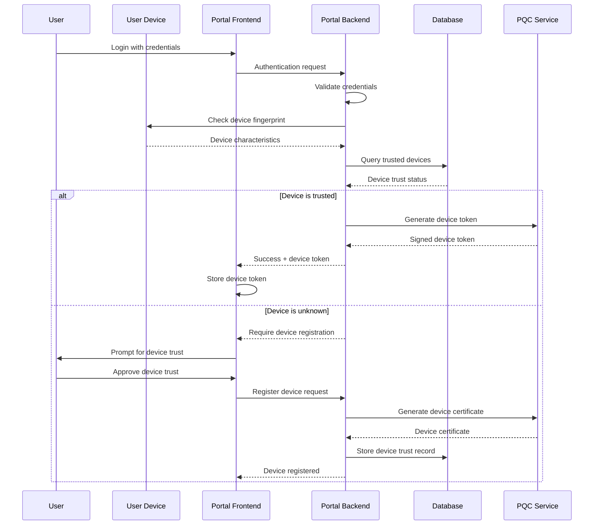

# Device Trust Management Documentation (WBS 1.15)

## Overview

This document provides implementation guidance for trusted device workflows in the Quantum Safe Privacy Portal. Device trust enables enhanced security by establishing and maintaining trust relationships with user devices, reducing authentication friction for known devices while maintaining security for unknown devices.

## Architecture Overview

### Device Trust Flow



## Implementation Requirements

### Backend Components

#### 1. Device Trust Service
```typescript
// src/auth/device-trust.service.ts
interface DeviceTrustService {
  generateDeviceFingerprint(request: Request): Promise<string>;
  registerTrustedDevice(userId: string, deviceInfo: DeviceInfo): Promise<TrustedDevice>;
  validateDeviceTrust(userId: string, deviceFingerprint: string): Promise<boolean>;
  revokeTrustedDevice(userId: string, deviceId: string): Promise<void>;
  listTrustedDevices(userId: string): Promise<TrustedDevice[]>;
}
```

#### 2. Device Fingerprinting
- Browser characteristics (User-Agent, screen resolution, timezone)
- Hardware fingerprinting (available fonts, canvas fingerprint)
- Network characteristics (IP address patterns)
- Post-quantum cryptographic device certificates

#### 3. Database Schema
```sql
CREATE TABLE trusted_devices (
  id UUID PRIMARY KEY,
  user_id UUID NOT NULL REFERENCES users(id),
  device_fingerprint VARCHAR(255) NOT NULL,
  device_name VARCHAR(100),
  device_type ENUM('desktop', 'mobile', 'tablet'),
  browser_info JSONB,
  last_seen TIMESTAMP,
  trust_level ENUM('basic', 'enhanced', 'full'),
  pqc_certificate TEXT,
  created_at TIMESTAMP DEFAULT NOW(),
  expires_at TIMESTAMP,
  is_active BOOLEAN DEFAULT true
);
```

### Frontend Components

#### 1. Device Registration Flow
```typescript
// src/components/auth/DeviceRegistration.tsx
interface DeviceRegistrationProps {
  onDeviceRegistered: (device: TrustedDevice) => void;
  onSkip: () => void;
}
```

#### 2. Trusted Device Management
```typescript
// src/pages/TrustedDevices.tsx
interface TrustedDevicesPageProps {
  devices: TrustedDevice[];
  onRevokeDevice: (deviceId: string) => void;
  onRenameDevice: (deviceId: string, newName: string) => void;
}
```

#### 3. Device Trust Indicators
- Visual indicators for trusted vs untrusted devices
- Device trust status in user profile
- Security notifications for new device logins

## Security Considerations

### Device Fingerprinting Security
- Use multiple fingerprinting techniques for robustness
- Implement anti-spoofing measures
- Regular fingerprint validation and updates
- Privacy-preserving fingerprinting methods

### Post-Quantum Cryptography Integration
- Device certificates using PQC algorithms
- Secure device key exchange protocols
- Quantum-resistant device authentication
- Migration strategy for classical to PQC certificates

### Trust Level Management
- **Basic Trust**: Standard device recognition
- **Enhanced Trust**: Biometric validation required
- **Full Trust**: Hardware security module integration

## Implementation Phases

### Phase 1: Basic Device Recognition
- [ ] Device fingerprinting implementation
- [ ] Basic device registration flow
- [ ] Device trust database schema
- [ ] Simple trust validation

### Phase 2: Enhanced Security Features
- [ ] Post-quantum device certificates
- [ ] Multi-factor device validation
- [ ] Device trust levels implementation
- [ ] Advanced fingerprinting techniques

### Phase 3: Advanced Management
- [ ] Device trust analytics
- [ ] Automated trust scoring
- [ ] Device behavior analysis
- [ ] Enterprise device policies

## API Endpoints

### Device Trust Management
```typescript
// Device registration
POST /portal/auth/devices/register
{
  "deviceName": "John's MacBook Pro",
  "deviceType": "desktop",
  "trustLevel": "basic"
}

// List trusted devices
GET /portal/auth/devices

// Revoke device trust
DELETE /portal/auth/devices/{deviceId}

// Update device information
PUT /portal/auth/devices/{deviceId}
{
  "deviceName": "Updated Device Name",
  "trustLevel": "enhanced"
}
```

## Testing Strategy

### Unit Tests
- Device fingerprinting accuracy
- Trust validation logic
- PQC certificate generation
- Database operations

### Integration Tests
- Complete device registration flow
- Device trust validation during login
- Device revocation scenarios
- Cross-browser compatibility

### Security Tests
- Fingerprint spoofing resistance
- Certificate validation
- Trust level enforcement
- Privacy compliance

## User Experience Guidelines

### Device Registration UX
- Clear explanation of device trust benefits
- Optional device registration (not mandatory)
- Simple device naming and management
- Visual trust indicators

### Security Notifications
- New device login alerts
- Device trust status changes
- Security recommendations
- Privacy controls

## Privacy Considerations

### Data Collection
- Minimal fingerprinting data collection
- User consent for device tracking
- Data retention policies
- GDPR compliance for device data

### User Control
- Device trust opt-out options
- Granular privacy controls
- Data export capabilities
- Device data deletion

## Monitoring and Analytics

### Key Metrics
- Device registration rates
- Trust validation success rates
- Device revocation frequency
- Security incident correlation

### Security Monitoring
- Suspicious device patterns
- Fingerprint collision detection
- Trust level violations
- Anomalous device behavior

## Future Enhancements

### Advanced Features
- Hardware security module integration
- Biometric device binding
- Zero-knowledge device proofs
- Federated device trust

### Enterprise Features
- Centralized device management
- Device compliance policies
- Bulk device operations
- Device trust reporting

## Dependencies

### Required Libraries
- Device fingerprinting library
- Post-quantum cryptography library
- Database migration tools
- Security monitoring tools

### External Services
- Hardware security modules (optional)
- Device intelligence services
- Fraud detection services
- Analytics platforms

## Compliance Requirements

### Security Standards
- NIST Cybersecurity Framework
- ISO 27001 compliance
- SOC 2 Type II requirements
- Industry-specific regulations

### Privacy Regulations
- GDPR compliance
- CCPA requirements
- Regional privacy laws
- Data localization requirements
