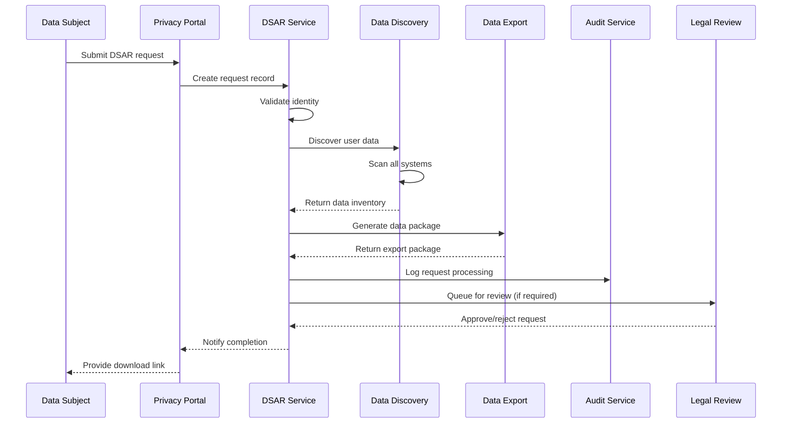

# Data Subject Access Rights (DSAR) Documentation (WBS 1.21)

## Overview

This document provides implementation guidance for GDPR compliance and Data Subject Access Rights (DSAR) in the Quantum Safe Privacy Portal. It covers automated request processing, data discovery, privacy controls, consent management, and regulatory compliance features.

## Architecture Overview

### DSAR Processing Flow



### Privacy Rights Framework

```mermaid
graph TD
    A[GDPR Rights] --> B[Right to Access]
    A --> C[Right to Rectification]
    A --> D[Right to Erasure]
    A --> E[Right to Portability]
    A --> F[Right to Restrict Processing]
    A --> G[Right to Object]
    A --> H[Rights Related to Automated Decision Making]
    
    B --> B1[Personal Data Export]
    B --> B2[Processing Activities]
    B --> B3[Data Sources]
    
    C --> C1[Data Correction]
    C --> C2[Profile Updates]
    C --> C3[Accuracy Verification]
    
    D --> D1[Account Deletion]
    D --> D2[Data Anonymization]
    D --> D3[Backup Purging]
    
    E --> E1[Structured Data Export]
    E --> E2[Machine Readable Format]
    E --> E3[Direct Transfer]
    
    F --> F1[Processing Suspension]
    F --> F2[Data Quarantine]
    F --> F3[Limited Access]
    
    G --> G1[Marketing Opt-out]
    G --> G2[Profiling Objection]
    G --> G3[Legitimate Interest Override]
    
    H --> H1[Automated Decision Explanation]
    H --> H2[Human Review Request]
    H --> H3[Decision Challenge]
```



## Implementation Requirements

### Backend Components

#### 1. DSAR Service
```typescript
// src/privacy/dsar.service.ts
interface DSARService {
  submitRequest(request: DSARRequest): Promise<DSARCase>;
  processRequest(caseId: string): Promise<DSARResult>;
  validateIdentity(request: DSARRequest): Promise<IdentityValidation>;
  discoverUserData(userId: string): Promise<DataInventory>;
  exportUserData(userId: string, format: ExportFormat): Promise<DataExport>;
  deleteUserData(userId: string, options: DeletionOptions): Promise<DeletionResult>;
  anonymizeUserData(userId: string): Promise<AnonymizationResult>;
}

interface DSARRequest {
  requestType: DSARRequestType;
  dataSubject: DataSubject;
  identityProof: IdentityProof;
  requestDetails: string;
  preferredFormat?: ExportFormat;
  urgency: 'standard' | 'urgent';
  legalBasis?: string;
}

enum DSARRequestType {
  ACCESS = 'access',
  RECTIFICATION = 'rectification',
  ERASURE = 'erasure',
  PORTABILITY = 'portability',
  RESTRICTION = 'restriction',
  OBJECTION = 'objection',
  AUTOMATED_DECISION = 'automated_decision'
}

interface DataSubject {
  email: string;
  firstName?: string;
  lastName?: string;
  phoneNumber?: string;
  address?: Address;
  identifiers?: Record<string, string>;
}
```

#### 2. Data Discovery Service
```typescript
// src/privacy/data-discovery.service.ts
interface DataDiscoveryService {
  scanAllSystems(userId: string): Promise<DataInventory>;
  scanDatabase(userId: string, database: string): Promise<DatabaseScanResult>;
  scanFileStorage(userId: string, storage: string): Promise<FileStorageScanResult>;
  scanLogs(userId: string, timeRange: TimeRange): Promise<LogScanResult>;
  scanBackups(userId: string): Promise<BackupScanResult>;
  generateDataMap(userId: string): Promise<DataMap>;
}

interface DataInventory {
  userId: string;
  personalData: PersonalDataRecord[];
  processingActivities: ProcessingActivity[];
  dataRetention: RetentionPolicy[];
  thirdPartySharing: ThirdPartySharing[];
  legalBasis: LegalBasisRecord[];
  totalRecords: number;
  lastUpdated: Date;
}

interface PersonalDataRecord {
  id: string;
  dataType: PersonalDataType;
  location: DataLocation;
  format: DataFormat;
  sensitivity: DataSensitivity;
  size: number;
  createdAt: Date;
  lastAccessed?: Date;
  retentionPeriod: string;
  legalBasis: string;
}
```

#### 3. Data Export Service
```typescript
// src/privacy/data-export.service.ts
interface DataExportService {
  exportUserData(userId: string, format: ExportFormat): Promise<DataExport>;
  generatePortableData(userId: string): Promise<PortableDataPackage>;
  createDataPackage(inventory: DataInventory): Promise<DataPackage>;
  validateExportRequest(request: DSARRequest): Promise<ValidationResult>;
  scheduleExport(userId: string, options: ExportOptions): Promise<ExportJob>;
}

enum ExportFormat {
  JSON = 'json',
  CSV = 'csv',
  XML = 'xml',
  PDF = 'pdf',
  ZIP = 'zip'
}

interface DataExport {
  exportId: string;
  userId: string;
  format: ExportFormat;
  fileUrl: string;
  fileSize: number;
  recordCount: number;
  generatedAt: Date;
  expiresAt: Date;
  downloadCount: number;
  checksum: string;
}
```

#### 4. Database Schema
```sql
CREATE TABLE dsar_requests (
  id UUID PRIMARY KEY,
  request_type VARCHAR(50) NOT NULL,
  data_subject_email VARCHAR(255) NOT NULL,
  data_subject_info JSONB NOT NULL,
  identity_verified BOOLEAN DEFAULT false,
  identity_proof JSONB,
  request_details TEXT,
  preferred_format VARCHAR(20) DEFAULT 'json',
  urgency VARCHAR(20) DEFAULT 'standard',
  status ENUM('pending', 'in_progress', 'completed', 'rejected', 'expired') DEFAULT 'pending',
  legal_basis TEXT,
  assigned_to UUID REFERENCES users(id),
  due_date TIMESTAMP,
  completed_at TIMESTAMP,
  rejection_reason TEXT,
  created_at TIMESTAMP DEFAULT NOW(),
  updated_at TIMESTAMP DEFAULT NOW()
);

CREATE TABLE data_inventory (
  id UUID PRIMARY KEY,
  user_id UUID NOT NULL REFERENCES users(id),
  data_type VARCHAR(100) NOT NULL,
  data_location VARCHAR(255) NOT NULL,
  data_format VARCHAR(50),
  sensitivity_level VARCHAR(20),
  record_count INTEGER,
  data_size BIGINT,
  legal_basis VARCHAR(100),
  retention_period VARCHAR(50),
  last_accessed TIMESTAMP,
  created_at TIMESTAMP DEFAULT NOW()
);

CREATE TABLE data_exports (
  id UUID PRIMARY KEY,
  dsar_request_id UUID REFERENCES dsar_requests(id),
  user_id UUID NOT NULL REFERENCES users(id),
  export_format VARCHAR(20) NOT NULL,
  file_path VARCHAR(500),
  file_size BIGINT,
  record_count INTEGER,
  checksum VARCHAR(255),
  download_count INTEGER DEFAULT 0,
  expires_at TIMESTAMP,
  created_at TIMESTAMP DEFAULT NOW()
);

CREATE TABLE processing_activities (
  id UUID PRIMARY KEY,
  activity_name VARCHAR(255) NOT NULL,
  purpose TEXT NOT NULL,
  legal_basis VARCHAR(100) NOT NULL,
  data_categories JSONB NOT NULL,
  data_subjects JSONB NOT NULL,
  recipients JSONB,
  retention_period VARCHAR(100),
  security_measures JSONB,
  created_at TIMESTAMP DEFAULT NOW(),
  updated_at TIMESTAMP DEFAULT NOW()
);

CREATE TABLE consent_records (
  id UUID PRIMARY KEY,
  user_id UUID NOT NULL REFERENCES users(id),
  consent_type VARCHAR(100) NOT NULL,
  purpose TEXT NOT NULL,
  granted_at TIMESTAMP,
  withdrawn_at TIMESTAMP,
  consent_method VARCHAR(50),
  consent_evidence JSONB,
  is_active BOOLEAN DEFAULT true,
  created_at TIMESTAMP DEFAULT NOW()
);
```

### Frontend Components

#### 1. DSAR Request Form
```typescript
// src/components/privacy/DSARRequestForm.tsx
interface DSARRequestFormProps {
  onSubmit: (request: DSARRequest) => void;
  requestTypes: DSARRequestType[];
  supportedFormats: ExportFormat[];
}

interface DSARRequestFormData {
  requestType: DSARRequestType;
  email: string;
  firstName: string;
  lastName: string;
  phoneNumber?: string;
  address?: Address;
  identityProof: File[];
  requestDetails: string;
  preferredFormat: ExportFormat;
  urgency: 'standard' | 'urgent';
}
```

#### 2. Privacy Dashboard
```typescript
// src/components/privacy/PrivacyDashboard.tsx
interface PrivacyDashboardProps {
  user: User;
  consentRecords: ConsentRecord[];
  dataInventory: DataInventory;
  onConsentUpdate: (consentId: string, granted: boolean) => void;
  onDataExport: (format: ExportFormat) => void;
  onDataDeletion: () => void;
}
```

#### 3. Data Consent Management
```typescript
// src/components/privacy/ConsentManager.tsx
interface ConsentManagerProps {
  consents: ConsentRecord[];
  onConsentChange: (consentType: string, granted: boolean) => void;
  onConsentHistory: (consentType: string) => void;
}

interface ConsentRecord {
  id: string;
  type: string;
  purpose: string;
  granted: boolean;
  grantedAt?: Date;
  withdrawnAt?: Date;
  isRequired: boolean;
  description: string;
}
```

## GDPR Rights Implementation

### Right to Access (Article 15)
```typescript
class AccessRightHandler {
  async processAccessRequest(request: DSARRequest): Promise<DataExport> {
    // Verify identity
    await this.verifyIdentity(request);
    
    // Discover all user data
    const inventory = await this.dataDiscovery.scanAllSystems(request.dataSubject.email);
    
    // Generate comprehensive data export
    const dataExport = await this.dataExport.exportUserData(
      inventory.userId,
      request.preferredFormat || ExportFormat.JSON
    );
    
    // Include processing information
    const processingInfo = await this.getProcessingActivities(inventory.userId);
    
    return {
      ...dataExport,
      processingActivities: processingInfo,
      dataRetention: inventory.dataRetention,
      thirdPartySharing: inventory.thirdPartySharing
    };
  }
}
```

### Right to Rectification (Article 16)
```typescript
class RectificationRightHandler {
  async processRectificationRequest(request: DSARRequest): Promise<RectificationResult> {
    // Verify identity and validate corrections
    await this.verifyIdentity(request);
    const corrections = this.parseCorrections(request.requestDetails);
    
    // Apply corrections across all systems
    const results = await Promise.all([
      this.updateUserProfile(request.dataSubject.email, corrections),
      this.updateDatabaseRecords(request.dataSubject.email, corrections),
      this.updateBackupSystems(request.dataSubject.email, corrections)
    ]);
    
    // Log rectification activities
    await this.auditService.logRectification(request.dataSubject.email, corrections);
    
    return {
      correctedFields: corrections,
      systemsUpdated: results.length,
      completedAt: new Date()
    };
  }
}
```

### Right to Erasure (Article 17)
```typescript
class ErasureRightHandler {
  async processErasureRequest(request: DSARRequest): Promise<ErasureResult> {
    // Verify identity and legal grounds
    await this.verifyIdentity(request);
    await this.validateErasureGrounds(request);
    
    // Check for legal obligations to retain data
    const retentionCheck = await this.checkRetentionObligations(request.dataSubject.email);
    if (retentionCheck.hasObligations) {
      throw new Error(`Cannot erase data due to legal obligations: ${retentionCheck.reasons.join(', ')}`);
    }
    
    // Perform erasure across all systems
    const erasureResults = await this.performErasure(request.dataSubject.email);
    
    // Notify third parties if required
    await this.notifyThirdParties(request.dataSubject.email, 'erasure');
    
    return erasureResults;
  }

  private async performErasure(email: string): Promise<ErasureResult> {
    const results = await Promise.all([
      this.eraseUserAccount(email),
      this.eraseDatabaseRecords(email),
      this.eraseFileStorage(email),
      this.eraseLogs(email),
      this.eraseBackups(email)
    ]);

    return {
      systemsProcessed: results.length,
      recordsErased: results.reduce((sum, r) => sum + r.recordsErased, 0),
      filesDeleted: results.reduce((sum, r) => sum + r.filesDeleted, 0),
      completedAt: new Date()
    };
  }
}
```

### Right to Data Portability (Article 20)
```typescript
class PortabilityRightHandler {
  async processPortabilityRequest(request: DSARRequest): Promise<PortableDataPackage> {
    // Verify identity
    await this.verifyIdentity(request);
    
    // Extract portable data (structured, commonly used formats)
    const portableData = await this.extractPortableData(request.dataSubject.email);
    
    // Generate machine-readable export
    const dataPackage = await this.generatePortablePackage(portableData, {
      format: ExportFormat.JSON,
      includeMetadata: true,
      structuredFormat: true
    });
    
    return dataPackage;
  }

  private async extractPortableData(email: string): Promise<PortableData> {
    return {
      profile: await this.getUserProfile(email),
      preferences: await this.getUserPreferences(email),
      content: await this.getUserGeneratedContent(email),
      interactions: await this.getUserInteractions(email),
      metadata: {
        exportedAt: new Date(),
        dataController: 'Quantum Safe Privacy Portal',
        format: 'JSON',
        version: '1.0'
      }
    };
  }
}
```

## Identity Verification

### Multi-Factor Identity Verification
```typescript
class IdentityVerificationService {
  async verifyIdentity(request: DSARRequest): Promise<IdentityValidation> {
    const verificationMethods = [];
    
    // Email verification
    if (request.dataSubject.email) {
      verificationMethods.push(await this.verifyEmail(request.dataSubject.email));
    }
    
    // Document verification
    if (request.identityProof) {
      verificationMethods.push(await this.verifyDocuments(request.identityProof));
    }
    
    // Knowledge-based verification
    verificationMethods.push(await this.performKnowledgeBasedAuth(request.dataSubject));
    
    const verificationScore = this.calculateVerificationScore(verificationMethods);
    
    return {
      verified: verificationScore >= this.VERIFICATION_THRESHOLD,
      score: verificationScore,
      methods: verificationMethods,
      riskLevel: this.assessRiskLevel(verificationScore)
    };
  }

  private async verifyDocuments(documents: File[]): Promise<DocumentVerification> {
    // Use OCR and document validation services
    const results = await Promise.all(
      documents.map(doc => this.documentValidator.validate(doc))
    );
    
    return {
      documentsVerified: results.filter(r => r.valid).length,
      totalDocuments: documents.length,
      confidence: results.reduce((sum, r) => sum + r.confidence, 0) / results.length
    };
  }
}
```

## Automated Processing

### DSAR Workflow Engine
```typescript
class DSARWorkflowEngine {
  async processRequest(requestId: string): Promise<void> {
    const request = await this.getRequest(requestId);
    
    try {
      // Step 1: Identity verification
      const identityResult = await this.verifyIdentity(request);
      if (!identityResult.verified) {
        await this.rejectRequest(requestId, 'Identity verification failed');
        return;
      }
      
      // Step 2: Legal basis validation
      const legalValidation = await this.validateLegalBasis(request);
      if (!legalValidation.valid) {
        await this.rejectRequest(requestId, legalValidation.reason);
        return;
      }
      
      // Step 3: Process based on request type
      const result = await this.executeRequestType(request);
      
      // Step 4: Generate response
      await this.generateResponse(requestId, result);
      
      // Step 5: Complete request
      await this.completeRequest(requestId);
      
    } catch (error) {
      await this.handleRequestError(requestId, error);
    }
  }

  private async executeRequestType(request: DSARRequest): Promise<any> {
    switch (request.requestType) {
      case DSARRequestType.ACCESS:
        return await this.accessHandler.process(request);
      case DSARRequestType.RECTIFICATION:
        return await this.rectificationHandler.process(request);
      case DSARRequestType.ERASURE:
        return await this.erasureHandler.process(request);
      case DSARRequestType.PORTABILITY:
        return await this.portabilityHandler.process(request);
      case DSARRequestType.RESTRICTION:
        return await this.restrictionHandler.process(request);
      case DSARRequestType.OBJECTION:
        return await this.objectionHandler.process(request);
      default:
        throw new Error(`Unsupported request type: ${request.requestType}`);
    }
  }
}
```

## Implementation Phases

### Phase 1: Core DSAR Framework
- [ ] Basic request submission and tracking
- [ ] Identity verification system
- [ ] Data discovery service
- [ ] Simple data export functionality

### Phase 2: Advanced Rights Implementation
- [ ] Complete GDPR rights implementation
- [ ] Automated workflow engine
- [ ] Legal basis validation
- [ ] Third-party notification system

### Phase 3: Enterprise Features
- [ ] Advanced analytics and reporting
- [ ] Compliance dashboard
- [ ] Audit trail management
- [ ] Integration with legal systems

## API Endpoints

### DSAR Request Management
```typescript
// Submit DSAR request
POST /portal/privacy/dsar/requests
{
  "requestType": "access",
  "dataSubject": {
    "email": "user@example.com",
    "firstName": "John",
    "lastName": "Doe"
  },
  "requestDetails": "I would like to access all my personal data",
  "preferredFormat": "json"
}

// Get request status
GET /portal/privacy/dsar/requests/{requestId}

// Upload identity proof
POST /portal/privacy/dsar/requests/{requestId}/identity-proof
Content-Type: multipart/form-data

// Download data export
GET /portal/privacy/dsar/exports/{exportId}/download
```

### Privacy Management
```typescript
// Get user's data inventory
GET /portal/privacy/data-inventory

// Update consent preferences
PUT /portal/privacy/consent
{
  "marketing": false,
  "analytics": true,
  "functional": true
}

// Request data deletion
POST /portal/privacy/delete-account
{
  "reason": "No longer need the service",
  "confirmEmail": "user@example.com"
}
```

## Compliance Features

### GDPR Compliance Dashboard
```typescript
interface ComplianceDashboard {
  requestMetrics: {
    totalRequests: number;
    pendingRequests: number;
    completedRequests: number;
    averageProcessingTime: number;
    complianceRate: number;
  };
  dataInventory: {
    totalDataSubjects: number;
    dataCategories: string[];
    retentionPolicies: RetentionPolicy[];
    legalBases: string[];
  };
  riskAssessment: {
    highRiskProcessing: ProcessingActivity[];
    dataBreachRisk: number;
    complianceScore: number;
  };
}
```

### Audit Trail
```typescript
interface AuditTrail {
  logDSARRequest(request: DSARRequest): Promise<void>;
  logDataAccess(userId: string, dataType: string, purpose: string): Promise<void>;
  logDataModification(userId: string, changes: DataChange[]): Promise<void>;
  logDataDeletion(userId: string, deletionType: string): Promise<void>;
  logConsentChange(userId: string, consentType: string, granted: boolean): Promise<void>;
  generateComplianceReport(timeRange: TimeRange): Promise<ComplianceReport>;
}
```

## Security Considerations

### Data Protection
- **Encryption**: All personal data encrypted at rest and in transit
- **Access Control**: Role-based access to DSAR processing
- **Audit Logging**: Comprehensive audit trail for all data operations
- **Data Minimization**: Only collect and process necessary data

### Privacy by Design
- **Default Privacy Settings**: Privacy-friendly defaults
- **Consent Management**: Granular consent controls
- **Data Retention**: Automated data retention and deletion
- **Transparency**: Clear privacy notices and data usage information

## Testing Strategy

### Unit Tests
- DSAR request processing logic
- Identity verification methods
- Data discovery algorithms
- Export generation functions

### Integration Tests
- End-to-end DSAR workflows
- Cross-system data discovery
- Third-party notification systems
- Compliance reporting

### Compliance Testing
- GDPR requirements validation
- Data retention policy enforcement
- Consent management workflows
- Audit trail completeness

## Monitoring and Analytics

### DSAR Metrics
- Request volume and types
- Processing times and SLAs
- Identity verification success rates
- Data export download rates

### Compliance Metrics
- GDPR compliance score
- Data retention compliance
- Consent management effectiveness
- Audit trail completeness

### Risk Monitoring
- High-risk data processing activities
- Data breach indicators
- Compliance violations
- Third-party data sharing risks

## User Experience Guidelines

### DSAR Request UX
- **Simple Forms**: Easy-to-understand request forms
- **Clear Communication**: Regular status updates
- **Secure Downloads**: Secure data export delivery
- **Help and Support**: Comprehensive help documentation

### Privacy Dashboard UX
- **Transparency**: Clear data usage information
- **Control**: Easy consent management
- **Accessibility**: WCAG 2.1 AA compliance
- **Mobile-Friendly**: Responsive design for all devices

## Future Enhancements

### Advanced Features
- **AI-Powered Data Discovery**: Intelligent data classification
- **Automated Legal Analysis**: AI-assisted legal basis validation
- **Predictive Compliance**: Proactive compliance monitoring
- **Blockchain Audit Trail**: Immutable audit records

### International Compliance
- **CCPA Compliance**: California Consumer Privacy Act
- **LGPD Compliance**: Brazilian General Data Protection Law
- **PIPEDA Compliance**: Canadian Personal Information Protection
- **Regional Privacy Laws**: Support for additional jurisdictions

## Dependencies

### Required Libraries
- Document processing library (OCR)
- Identity verification service
- Data classification tools
- Compliance monitoring tools

### External Services
- Identity verification providers
- Document validation services
- Legal research databases
- Compliance monitoring platforms

## Migration Strategy

### Data Migration
- Legacy data classification
- Historical consent records
- Existing audit trails
- Privacy policy updates

### Training and Adoption
- Staff training on GDPR requirements
- User education on privacy rights
- Process documentation
- Compliance monitoring setup

## Compliance Requirements

### GDPR Articles
- Article 12: Transparent information and communication
- Article 13-14: Information to be provided
- Article 15: Right of access
- Article 16: Right to rectification
- Article 17: Right to erasure
- Article 18: Right to restriction of processing
- Article 20: Right to data portability
- Article 21: Right to object
- Article 22: Automated decision-making

### Documentation Requirements
- Privacy notices and policies
- Data processing records
- Consent management documentation
- Data protection impact assessments
- Breach notification procedures
