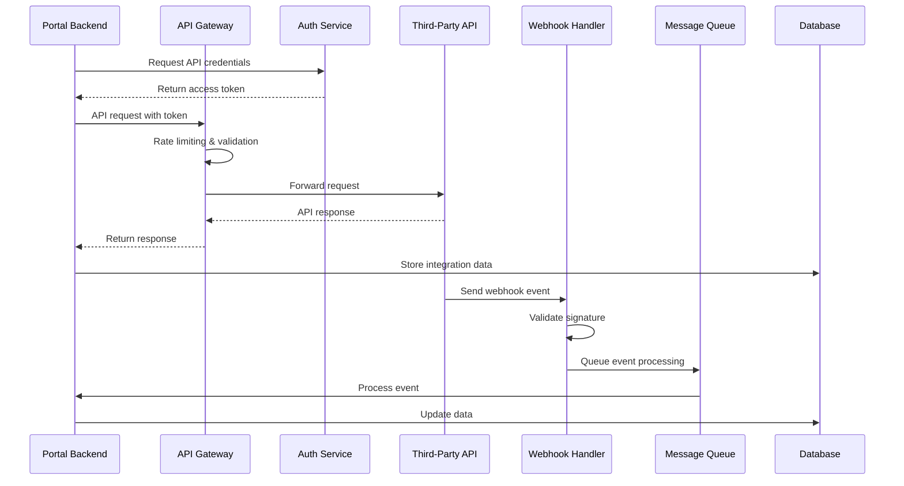

# Third-Party Integrations Documentation (WBS 1.20)

## Overview

This document provides implementation guidance for third-party API integrations in the Quantum Safe Privacy Portal. It covers integration patterns, security considerations, data synchronization, webhook handling, and enterprise service connectivity for seamless interoperability.

## Architecture Overview

### Integration System Flow



### Integration Categories

```mermaid
graph TD
    A[Third-Party Integrations] --> B[Identity Providers]
    A --> C[Cloud Storage]
    A --> D[Analytics Services]
    A --> E[Communication APIs]
    A --> F[Security Services]
    A --> G[Enterprise Systems]
    
    B --> B1[Active Directory]
    B --> B2[Okta]
    B --> B3[Auth0]
    B --> B4[Azure AD]
    
    C --> C1[AWS S3]
    C --> C2[Google Cloud Storage]
    C --> C3[Azure Blob Storage]
    C --> C4[Dropbox Business]
    
    D --> D1[Google Analytics]
    D --> D2[Mixpanel]
    D --> D3[Amplitude]
    D --> D4[Custom Analytics]
    
    E --> E1[SendGrid]
    E --> E2[Twilio]
    E --> E3[Slack]
    E --> E4[Microsoft Teams]
    
    F --> F1[Vulnerability Scanners]
    F --> F2[SIEM Systems]
    F --> F3[Threat Intelligence]
    F --> F4[Compliance Tools]
    
    G --> G1[CRM Systems]
    G --> G2[ERP Systems]
    G --> G3[HR Systems]
    G --> G4[Document Management]
```



## Implementation Requirements

### Backend Components

#### 1. Integration Service Framework
```typescript
// src/integrations/integration.service.ts
interface IntegrationService {
  registerIntegration(config: IntegrationConfig): Promise<Integration>;
  authenticateIntegration(integrationId: string): Promise<AuthResult>;
  executeRequest(integrationId: string, request: APIRequest): Promise<APIResponse>;
  handleWebhook(integrationId: string, payload: any, signature: string): Promise<void>;
  syncData(integrationId: string, syncConfig: SyncConfig): Promise<SyncResult>;
  getIntegrationStatus(integrationId: string): Promise<IntegrationStatus>;
}

interface IntegrationConfig {
  name: string;
  type: IntegrationType;
  baseUrl: string;
  authMethod: AuthMethod;
  credentials: IntegrationCredentials;
  rateLimits: RateLimitConfig;
  webhookConfig?: WebhookConfig;
  syncConfig?: SyncConfig;
}

enum IntegrationType {
  IDENTITY_PROVIDER = 'identity_provider',
  CLOUD_STORAGE = 'cloud_storage',
  ANALYTICS = 'analytics',
  COMMUNICATION = 'communication',
  SECURITY = 'security',
  ENTERPRISE = 'enterprise'
}

enum AuthMethod {
  API_KEY = 'api_key',
  OAUTH2 = 'oauth2',
  JWT = 'jwt',
  BASIC_AUTH = 'basic_auth',
  CUSTOM = 'custom'
}
```

#### 2. API Gateway Service
```typescript
// src/integrations/api-gateway.service.ts
interface APIGatewayService {
  routeRequest(request: APIRequest): Promise<APIResponse>;
  applyRateLimit(integrationId: string, endpoint: string): Promise<boolean>;
  validateRequest(request: APIRequest): Promise<ValidationResult>;
  transformRequest(request: APIRequest, config: TransformConfig): Promise<APIRequest>;
  transformResponse(response: APIResponse, config: TransformConfig): Promise<APIResponse>;
  cacheResponse(key: string, response: APIResponse, ttl: number): Promise<void>;
}

interface APIRequest {
  integrationId: string;
  method: 'GET' | 'POST' | 'PUT' | 'DELETE' | 'PATCH';
  endpoint: string;
  headers: Record<string, string>;
  body?: any;
  params?: Record<string, string>;
  timeout?: number;
}

interface APIResponse {
  status: number;
  headers: Record<string, string>;
  body: any;
  timestamp: Date;
  duration: number;
}
```

#### 3. Webhook Handler Service
```typescript
// src/integrations/webhook.service.ts
interface WebhookService {
  registerWebhook(config: WebhookConfig): Promise<WebhookEndpoint>;
  validateWebhook(payload: any, signature: string, secret: string): Promise<boolean>;
  processWebhook(event: WebhookEvent): Promise<void>;
  retryFailedWebhook(eventId: string): Promise<void>;
  getWebhookLogs(integrationId: string): Promise<WebhookLog[]>;
}

interface WebhookConfig {
  integrationId: string;
  endpoint: string;
  events: string[];
  secret: string;
  signatureHeader: string;
  signatureMethod: 'hmac-sha256' | 'hmac-sha1';
  retryPolicy: RetryPolicy;
}

interface WebhookEvent {
  id: string;
  integrationId: string;
  eventType: string;
  payload: any;
  timestamp: Date;
  signature: string;
}
```

#### 4. Database Schema
```sql
CREATE TABLE integrations (
  id UUID PRIMARY KEY,
  organization_id UUID REFERENCES organizations(id),
  name VARCHAR(255) NOT NULL,
  type VARCHAR(50) NOT NULL,
  base_url VARCHAR(500),
  auth_method VARCHAR(50) NOT NULL,
  credentials JSONB NOT NULL,
  config JSONB DEFAULT '{}',
  status ENUM('active', 'inactive', 'error', 'pending') DEFAULT 'pending',
  last_sync TIMESTAMP,
  created_at TIMESTAMP DEFAULT NOW(),
  updated_at TIMESTAMP DEFAULT NOW()
);

CREATE TABLE integration_requests (
  id UUID PRIMARY KEY,
  integration_id UUID REFERENCES integrations(id),
  method VARCHAR(10) NOT NULL,
  endpoint VARCHAR(500) NOT NULL,
  request_body JSONB,
  response_status INTEGER,
  response_body JSONB,
  duration_ms INTEGER,
  error_message TEXT,
  created_at TIMESTAMP DEFAULT NOW()
);

CREATE TABLE webhook_events (
  id UUID PRIMARY KEY,
  integration_id UUID REFERENCES integrations(id),
  event_type VARCHAR(100) NOT NULL,
  payload JSONB NOT NULL,
  signature VARCHAR(255),
  status ENUM('pending', 'processed', 'failed', 'retrying') DEFAULT 'pending',
  retry_count INTEGER DEFAULT 0,
  error_message TEXT,
  processed_at TIMESTAMP,
  created_at TIMESTAMP DEFAULT NOW()
);

CREATE TABLE sync_jobs (
  id UUID PRIMARY KEY,
  integration_id UUID REFERENCES integrations(id),
  sync_type VARCHAR(50) NOT NULL,
  status ENUM('running', 'completed', 'failed', 'cancelled') DEFAULT 'running',
  records_processed INTEGER DEFAULT 0,
  records_total INTEGER,
  error_message TEXT,
  started_at TIMESTAMP DEFAULT NOW(),
  completed_at TIMESTAMP
);
```

### Frontend Components

#### 1. Integration Management Interface
```typescript
// src/components/integrations/IntegrationManager.tsx
interface IntegrationManagerProps {
  integrations: Integration[];
  availableIntegrations: IntegrationType[];
  onIntegrationAdd: (config: IntegrationConfig) => void;
  onIntegrationUpdate: (id: string, config: Partial<IntegrationConfig>) => void;
  onIntegrationDelete: (id: string) => void;
  onIntegrationTest: (id: string) => void;
}

interface Integration {
  id: string;
  name: string;
  type: IntegrationType;
  status: IntegrationStatus;
  lastSync?: Date;
  errorMessage?: string;
  metrics: IntegrationMetrics;
}

interface IntegrationMetrics {
  totalRequests: number;
  successRate: number;
  averageResponseTime: number;
  lastError?: Date;
}
```

#### 2. Integration Configuration Forms
```typescript
// src/components/integrations/IntegrationConfig.tsx
interface IntegrationConfigProps {
  integrationType: IntegrationType;
  initialConfig?: Partial<IntegrationConfig>;
  onConfigSave: (config: IntegrationConfig) => void;
  onConfigTest: (config: IntegrationConfig) => Promise<TestResult>;
}

interface TestResult {
  success: boolean;
  message: string;
  details?: any;
}
```

#### 3. Webhook Management Interface
```typescript
// src/components/integrations/WebhookManager.tsx
interface WebhookManagerProps {
  webhooks: WebhookEndpoint[];
  onWebhookCreate: (config: WebhookConfig) => void;
  onWebhookUpdate: (id: string, config: Partial<WebhookConfig>) => void;
  onWebhookDelete: (id: string) => void;
  onWebhookTest: (id: string) => void;
}
```

## Integration Patterns

### 1. OAuth 2.0 Integration
```typescript
// OAuth 2.0 flow implementation
class OAuth2Integration {
  async initiateAuth(integrationId: string): Promise<string> {
    const config = await this.getIntegrationConfig(integrationId);
    const authUrl = `${config.authUrl}?` +
      `client_id=${config.clientId}&` +
      `redirect_uri=${config.redirectUri}&` +
      `response_type=code&` +
      `scope=${config.scope}&` +
      `state=${this.generateState()}`;
    
    return authUrl;
  }

  async handleCallback(code: string, state: string): Promise<TokenResponse> {
    const tokenResponse = await this.exchangeCodeForToken(code);
    await this.storeTokens(tokenResponse);
    return tokenResponse;
  }

  async refreshToken(integrationId: string): Promise<TokenResponse> {
    const refreshToken = await this.getRefreshToken(integrationId);
    const tokenResponse = await this.requestTokenRefresh(refreshToken);
    await this.updateTokens(integrationId, tokenResponse);
    return tokenResponse;
  }
}
```

### 2. API Key Integration
```typescript
// API Key authentication
class APIKeyIntegration {
  async authenticateRequest(request: APIRequest, config: IntegrationConfig): Promise<APIRequest> {
    const apiKey = await this.getAPIKey(config.integrationId);
    
    switch (config.keyLocation) {
      case 'header':
        request.headers[config.keyHeader] = apiKey;
        break;
      case 'query':
        request.params[config.keyParam] = apiKey;
        break;
      case 'body':
        request.body[config.keyField] = apiKey;
        break;
    }
    
    return request;
  }
}
```

### 3. Webhook Processing
```typescript
// Webhook event processing
class WebhookProcessor {
  async processEvent(event: WebhookEvent): Promise<void> {
    try {
      await this.validateEvent(event);
      
      switch (event.eventType) {
        case 'user.created':
          await this.handleUserCreated(event.payload);
          break;
        case 'user.updated':
          await this.handleUserUpdated(event.payload);
          break;
        case 'data.sync':
          await this.handleDataSync(event.payload);
          break;
        default:
          console.warn(`Unknown event type: ${event.eventType}`);
      }
      
      await this.markEventProcessed(event.id);
    } catch (error) {
      await this.handleEventError(event.id, error);
    }
  }

  async handleEventError(eventId: string, error: Error): Promise<void> {
    const event = await this.getEvent(eventId);
    event.retryCount++;
    
    if (event.retryCount < this.maxRetries) {
      await this.scheduleRetry(event);
    } else {
      await this.markEventFailed(eventId, error.message);
    }
  }
}
```

## Security Considerations

### Authentication Security
- **Credential Encryption**: Encrypt stored API keys and tokens
- **Token Rotation**: Automatic token refresh and rotation
- **Scope Limitation**: Minimal required permissions
- **Audit Logging**: Track all authentication events

### API Security
- **Rate Limiting**: Prevent API abuse and quota exhaustion
- **Request Validation**: Validate all incoming and outgoing requests
- **SSL/TLS**: Enforce encrypted connections
- **IP Whitelisting**: Restrict access to known IP addresses

### Webhook Security
```typescript
// Webhook signature validation
class WebhookValidator {
  validateSignature(payload: string, signature: string, secret: string): boolean {
    const expectedSignature = crypto
      .createHmac('sha256', secret)
      .update(payload)
      .digest('hex');
    
    return crypto.timingSafeEqual(
      Buffer.from(signature),
      Buffer.from(`sha256=${expectedSignature}`)
    );
  }

  validateTimestamp(timestamp: number, tolerance: number = 300): boolean {
    const now = Math.floor(Date.now() / 1000);
    return Math.abs(now - timestamp) <= tolerance;
  }
}
```

## Data Synchronization

### Sync Strategies
- **Full Sync**: Complete data refresh
- **Incremental Sync**: Only changed data
- **Real-time Sync**: Webhook-driven updates
- **Scheduled Sync**: Periodic synchronization

### Conflict Resolution
```typescript
interface ConflictResolution {
  strategy: 'source_wins' | 'destination_wins' | 'merge' | 'manual';
  rules: ConflictRule[];
}

interface ConflictRule {
  field: string;
  condition: string;
  action: 'overwrite' | 'preserve' | 'merge' | 'flag';
}

class SyncManager {
  async resolveConflict(
    sourceData: any,
    destinationData: any,
    resolution: ConflictResolution
  ): Promise<any> {
    switch (resolution.strategy) {
      case 'source_wins':
        return sourceData;
      case 'destination_wins':
        return destinationData;
      case 'merge':
        return this.mergeData(sourceData, destinationData, resolution.rules);
      case 'manual':
        await this.flagForManualReview(sourceData, destinationData);
        return destinationData;
    }
  }
}
```

## Implementation Phases

### Phase 1: Core Integration Framework
- [ ] Basic integration service
- [ ] API gateway implementation
- [ ] Authentication mechanisms
- [ ] Simple webhook handling

### Phase 2: Advanced Features
- [ ] Data synchronization
- [ ] Conflict resolution
- [ ] Rate limiting and caching
- [ ] Integration monitoring

### Phase 3: Enterprise Features
- [ ] Advanced security features
- [ ] Bulk operations
- [ ] Custom transformations
- [ ] Integration marketplace

## API Endpoints

### Integration Management
```typescript
// Create integration
POST /portal/integrations
{
  "name": "Salesforce CRM",
  "type": "enterprise",
  "baseUrl": "https://api.salesforce.com",
  "authMethod": "oauth2",
  "credentials": {
    "clientId": "...",
    "clientSecret": "..."
  }
}

// Test integration
POST /portal/integrations/{id}/test

// Sync data
POST /portal/integrations/{id}/sync
{
  "syncType": "incremental",
  "entities": ["users", "accounts"]
}

// Get integration status
GET /portal/integrations/{id}/status
```

### Webhook Management
```typescript
// Register webhook
POST /portal/integrations/{id}/webhooks
{
  "endpoint": "/webhooks/salesforce",
  "events": ["user.created", "user.updated"],
  "secret": "webhook-secret"
}

// Get webhook logs
GET /portal/integrations/{id}/webhooks/logs?limit=100
```

## Monitoring and Analytics

### Integration Metrics
- Request success/failure rates
- Response time distributions
- Error frequency and types
- Data sync statistics

### Performance Monitoring
```typescript
interface IntegrationMetrics {
  totalRequests: number;
  successfulRequests: number;
  failedRequests: number;
  averageResponseTime: number;
  p95ResponseTime: number;
  errorRate: number;
  lastError?: {
    timestamp: Date;
    message: string;
    endpoint: string;
  };
}

class MetricsCollector {
  async recordRequest(
    integrationId: string,
    endpoint: string,
    duration: number,
    success: boolean
  ): Promise<void> {
    await this.incrementCounter(`integration.${integrationId}.requests.total`);
    await this.recordHistogram(`integration.${integrationId}.duration`, duration);
    
    if (success) {
      await this.incrementCounter(`integration.${integrationId}.requests.success`);
    } else {
      await this.incrementCounter(`integration.${integrationId}.requests.error`);
    }
  }
}
```

### Alerting
- Integration failures
- High error rates
- Performance degradation
- Quota exhaustion

## Testing Strategy

### Unit Tests
- Integration service methods
- Authentication flows
- Webhook validation
- Data transformation

### Integration Tests
- End-to-end API flows
- Webhook processing
- Error handling
- Rate limiting

### Mock Testing
```typescript
// Mock third-party API for testing
class MockAPIServer {
  setupMocks(): void {
    nock('https://api.example.com')
      .get('/users')
      .reply(200, { users: [] });
    
    nock('https://api.example.com')
      .post('/users')
      .reply(201, { id: '123', name: 'Test User' });
  }
}
```

## Error Handling

### Error Categories
- **Authentication Errors**: Invalid credentials, expired tokens
- **Rate Limit Errors**: API quota exceeded
- **Network Errors**: Connection timeouts, DNS failures
- **Data Errors**: Invalid format, missing fields
- **Business Logic Errors**: Validation failures, conflicts

### Retry Strategies
```typescript
class RetryManager {
  async executeWithRetry<T>(
    operation: () => Promise<T>,
    config: RetryConfig
  ): Promise<T> {
    let lastError: Error;
    
    for (let attempt = 1; attempt <= config.maxAttempts; attempt++) {
      try {
        return await operation();
      } catch (error) {
        lastError = error;
        
        if (!this.shouldRetry(error, attempt, config)) {
          throw error;
        }
        
        await this.delay(this.calculateBackoff(attempt, config));
      }
    }
    
    throw lastError;
  }

  private calculateBackoff(attempt: number, config: RetryConfig): number {
    return Math.min(
      config.baseDelay * Math.pow(2, attempt - 1),
      config.maxDelay
    );
  }
}
```

## Compliance and Governance

### Data Privacy
- GDPR compliance for data transfers
- Data residency requirements
- Consent management
- Data minimization

### Security Compliance
- SOC 2 Type II requirements
- ISO 27001 compliance
- Industry-specific regulations
- Audit trail maintenance

### Integration Governance
- Approval workflows for new integrations
- Security reviews and assessments
- Performance monitoring and SLAs
- Documentation requirements

## Future Enhancements

### Advanced Features
- **AI-Powered Mapping**: Automatic field mapping
- **Smart Sync**: Intelligent synchronization
- **Integration Templates**: Pre-built configurations
- **Visual Integration Builder**: No-code integration setup

### Enterprise Features
- **Multi-tenant Isolation**: Secure tenant separation
- **Advanced Monitoring**: Real-time dashboards
- **Custom Connectors**: Build custom integrations
- **Integration Marketplace**: Shared integration library

## Dependencies

### Required Libraries
- HTTP client library (Axios)
- Webhook signature validation
- OAuth 2.0 client library
- Message queue system (Bull/Agenda)

### External Services
- API gateway service
- Message broker (Redis/RabbitMQ)
- Monitoring service (DataDog/New Relic)
- Secret management service

## Migration Strategy

### Legacy Integration Migration
- Assessment of existing integrations
- Migration planning and scheduling
- Data validation and testing
- Gradual cutover process

### Training and Documentation
- Integration best practices guide
- Developer documentation
- User training materials
- Support procedures
