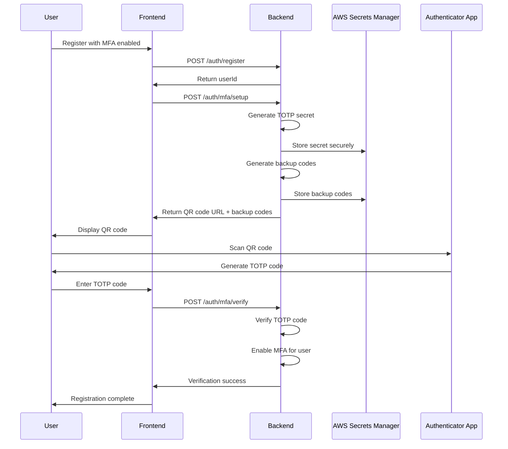
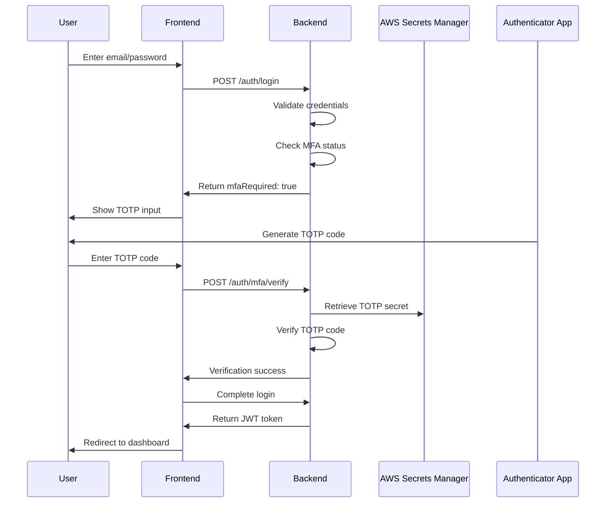

# Multi-Factor Authentication (MFA) Documentation

## Overview

The Quantum-Safe Privacy Portal implements Time-based One-Time Password (TOTP) Multi-Factor Authentication to provide an additional layer of security for user accounts. This implementation follows NIST guidelines and integrates seamlessly with the existing authentication system.

## Architecture

### Backend Components

#### MFAService (`src/auth/mfa.service.ts`)
- **TOTP Generation**: Uses `speakeasy` library for secure TOTP secret generation
- **Secret Storage**: Integrates with AWS Secrets Manager for secure secret persistence
- **Backup Codes**: Generates 10 single-use backup codes for account recovery
- **Audit Logging**: Comprehensive logging of all MFA events via AuditTrailService
- **Replay Protection**: Configurable TOTP window (default: 1) to prevent replay attacks

#### MFA Endpoints
- `POST /portal/auth/mfa/setup` - Initialize MFA for a user account
- `POST /portal/auth/mfa/verify` - Verify TOTP code or backup code
- `GET /portal/auth/mfa/status/:userId` - Check MFA enablement status
- `DELETE /portal/auth/mfa/disable` - Disable MFA for a user account

#### Database Schema Changes
```typescript
// User model extensions
interface User {
  mfaEnabled: boolean;
  mfaEnabledAt?: Date;
  mfaSecret?: string; // Stored in AWS Secrets Manager
}
```

### Frontend Components

#### Login Flow (`src/pages/Login.tsx`)
- **Two-Step Process**: Password validation followed by TOTP verification
- **Material-UI Stepper**: Visual progress indicator for authentication steps
- **Conditional MFA**: Only prompts for TOTP when user has MFA enabled
- **Error Handling**: Comprehensive error states and user feedback

#### Registration Flow (`src/components/auth/Register.tsx`)
- **Optional MFA Setup**: Checkbox to enable MFA during registration
- **QR Code Display**: Uses `qrcode.react` for authenticator app setup
- **Backup Codes**: Displays and allows copying of recovery codes
- **TOTP Verification**: Requires successful verification before account creation

## Security Features

### TOTP Configuration
```typescript
const totpConfig = {
  name: `Quantum-Safe Privacy Portal (${userEmail})`,
  issuer: 'Quantum-Safe Privacy Portal',
  length: 32,
  window: 1, // Replay protection
  step: 30,  // 30-second time window
};
```

### Secret Management
- **AWS Secrets Manager**: All TOTP secrets stored securely in AWS
- **Secret Rotation**: Secrets can be regenerated and updated
- **Backup Codes**: One-time use codes stored separately from TOTP secrets
- **Memory Cache**: Local caching with TTL for performance optimization

### Audit Trail
All MFA events are logged with the following event types:
- `MFA_SETUP_INITIATED` - User begins MFA setup process
- `MFA_SETUP_COMPLETED` - User successfully completes MFA setup
- `MFA_VERIFICATION_SUCCESS` - Successful TOTP/backup code verification
- `MFA_VERIFICATION_FAILED` - Failed verification attempt
- `MFA_DISABLED` - User disables MFA on their account

## Flow Diagrams

### MFA Setup Flow


### MFA Login Flow


## Testing Instructions

### Manual Testing Checklist

#### Setup Flow Testing
1. **Registration with MFA**
   - [ ] Register new user with MFA checkbox enabled
   - [ ] Verify QR code displays correctly
   - [ ] Scan QR code with Google Authenticator/Authy
   - [ ] Verify backup codes are displayed and copyable
   - [ ] Enter TOTP code from authenticator app
   - [ ] Verify successful registration completion

2. **Login Flow Testing**
   - [ ] Log out and attempt login with new MFA-enabled user
   - [ ] Verify two-step authentication flow
   - [ ] Enter correct TOTP code and verify successful login
   - [ ] Test invalid TOTP code handling
   - [ ] Test backup code usage

#### Error Scenarios
3. **Error Handling**
   - [ ] Test expired TOTP codes
   - [ ] Test malformed TOTP input
   - [ ] Test network failures during MFA setup
   - [ ] Test backup code reuse prevention
   - [ ] Test MFA setup for already-enabled users

#### Regression Testing
4. **Existing User Flow**
   - [ ] Verify users without MFA can still login normally
   - [ ] Test password-only authentication for non-MFA users
   - [ ] Verify no breaking changes to existing auth flow

### Unit Test Coverage

The implementation includes comprehensive unit tests in `mfa.service.spec.ts`:
- TOTP generation and verification
- Backup code functionality
- Error handling scenarios
- AWS Secrets Manager integration
- Audit logging verification

### Integration Testing

```bash
# Run MFA-specific tests
npm run test -- --grep "MFA"

# Run full authentication test suite
npm run test:auth

# Run end-to-end tests
npm run test:e2e
```

## Configuration

### Environment Variables
```bash
# AWS Secrets Manager configuration
AWS_REGION=us-east-1
AWS_ACCESS_KEY_ID=your_access_key
AWS_SECRET_ACCESS_KEY=your_secret_key

# MFA configuration
MFA_ISSUER_NAME="Quantum-Safe Privacy Portal"
MFA_TOTP_WINDOW=1
MFA_BACKUP_CODES_COUNT=10
```

### Feature Flags
```typescript
// Enable/disable MFA functionality
const MFA_ENABLED = process.env.MFA_ENABLED === 'true';
```

## Troubleshooting

### Common Issues

1. **QR Code Not Displaying**
   - Verify `qrcode.react` dependency is installed
   - Check browser console for JavaScript errors
   - Ensure TOTP secret generation is successful

2. **TOTP Verification Failures**
   - Check system time synchronization
   - Verify TOTP window configuration
   - Confirm secret storage in AWS Secrets Manager

3. **AWS Secrets Manager Errors**
   - Verify AWS credentials and permissions
   - Check AWS region configuration
   - Ensure Secrets Manager service availability

### Debug Commands
```bash
# Check MFA service logs
kubectl logs -f deployment/portal-backend | grep MFA

# Verify AWS Secrets Manager connectivity
aws secretsmanager list-secrets --region us-east-1

# Test TOTP generation locally
npm run test:mfa:debug
```

## Security Considerations

### Best Practices Implemented
- **Secret Isolation**: TOTP secrets never logged or exposed in responses
- **Replay Protection**: Time-window based verification prevents replay attacks
- **Backup Codes**: Single-use recovery codes for account access
- **Audit Trail**: Comprehensive logging for security monitoring
- **Graceful Degradation**: System remains functional if MFA service fails

### Security Recommendations
- Regular backup code regeneration
- Monitor failed MFA attempts for suspicious activity
- Implement rate limiting on MFA verification endpoints
- Regular security audits of MFA implementation
- User education on authenticator app security

## Future Enhancements

### Planned Features
- **SMS/Email Backup**: Alternative verification methods
- **Hardware Token Support**: FIDO2/WebAuthn integration
- **Admin MFA Management**: Administrative controls for MFA policies
- **Risk-Based Authentication**: Conditional MFA based on login patterns
- **Recovery Workflows**: Enhanced account recovery processes

### Performance Optimizations
- **Secret Caching**: Improved caching strategies for TOTP secrets
- **Batch Operations**: Bulk MFA operations for administrative tasks
- **CDN Integration**: Optimized QR code delivery
