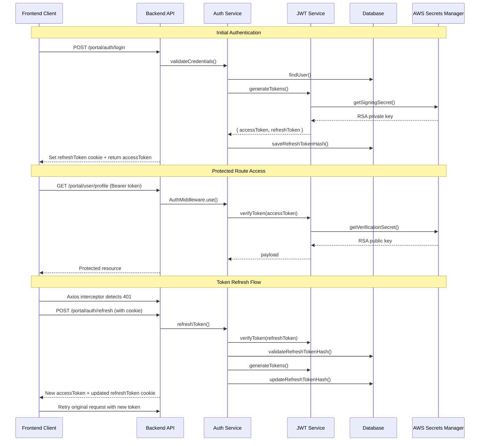

# Session Management Documentation

## Overview

This document provides comprehensive guidance on the session management implementation for the Quantum Safe Privacy Portal, covering JWT token lifecycle, refresh token rotation, protected route implementation (WBS 1.12), and Multi-Factor Authentication integration (WBS 1.13).

## JWT Token Lifecycle

### Token Configuration
- **Access Token**: 15 minutes expiration
- **Refresh Token**: 7 days expiration
- **Algorithm**: RS256 with AWS Secrets Manager integration
- **Storage**: Access tokens in localStorage (temporary), refresh tokens in HttpOnly cookies

### Token Flow Diagram



## Refresh Token Rotation Process

### Implementation Details

1. **Token Validation**
   - Verify refresh token signature using JWT service
   - Validate token hasn't expired (7-day TTL)
   - Check token hash against stored hash in database

2. **Token Rotation**
   - Generate new access token (15-minute TTL)
   - Generate new refresh token (7-day TTL)
   - Hash new refresh token with bcrypt (salt rounds: 10)
   - Update user record with new refresh token hash
   - Invalidate previous refresh token

3. **Security Measures**
   - Refresh token reuse detection
   - Automatic logout on invalid refresh attempts
   - Blacklist logging for audit trails
   - Secure cookie attributes (HttpOnly, Secure, SameSite)

### Code Example

```typescript
// Backend: auth.service.ts
async refreshToken(refreshToken: string): Promise<RefreshResult> {
  // 1. Verify refresh token
  const payload = this.jwtService.verifyToken(refreshToken, 'refresh');
  
  // 2. Validate user and token hash
  const user = await this.userModel.findById(payload.userId).select('+refreshTokenHash');
  const isValid = await bcrypt.compare(refreshToken, user.refreshTokenHash);
  
  // 3. Generate new tokens
  const { accessToken, refreshToken: newRefreshToken } = this.jwtService.generateTokens(payload, false);
  
  // 4. Update stored hash
  user.refreshTokenHash = await bcrypt.hash(newRefreshToken, 10);
  await user.save();
  
  return { accessToken, refreshToken: newRefreshToken, user };
}
```

## Protected Route Implementation

### Backend Route Protection

#### AuthMiddleware Configuration
```typescript
// auth.module.ts
export class AuthModule implements NestModule {
  configure(consumer: MiddlewareConsumer) {
    consumer
      .apply(AuthMiddleware)
      .forRoutes('portal/user/*', 'portal/pqc/*');
  }
}
```

#### Middleware Implementation
- Extracts JWT from Authorization header
- Validates token signature and expiration
- Attaches user payload to request object
- Returns 401 with JSON error for invalid tokens

### Frontend Route Protection

#### ProtectedRoute Component
```typescript
// ProtectedRoute.tsx
const ProtectedRoute: React.FC<ProtectedRouteProps> = ({ children }) => {
  const { isAuthenticated, isLoading, user } = useAuth();
  const [isCheckingToken, setIsCheckingToken] = useState(false);

  useEffect(() => {
    const checkTokenValidity = async () => {
      const token = localStorage.getItem('accessToken');
      
      if (token && isTokenExpired(token)) {
        // Attempt token refresh
        await fetch('/api/auth/refresh', {
          method: 'POST',
          credentials: 'include',
        });
      }
    };

    if (isAuthenticated && user) {
      checkTokenValidity();
    }
  }, [isAuthenticated, user]);

  if (!isAuthenticated) {
    return <Navigate to="/login" state={{ from: location }} replace />;
  }

  return <>{children}</>;
};
```

#### Axios Interceptor for Automatic Refresh
```typescript
// api.ts
apiClient.interceptors.response.use(
  (response) => response,
  async (error: AxiosError) => {
    if (error.response?.status === 401 && !originalRequest._retry) {
      try {
        const response = await apiClient.post('/auth/refresh', {}, {
          withCredentials: true,
        });
        
        const { accessToken } = response.data;
        setAuthToken(accessToken);
        localStorage.setItem('accessToken', accessToken);
        
        // Retry original request
        return apiClient(originalRequest);
      } catch (refreshError) {
        // Redirect to login
        window.dispatchEvent(new CustomEvent('auth:unauthorized'));
      }
    }
    
    return Promise.reject(error);
  }
);
```

## Security Considerations

### Compliance Mappings

#### NIST SP 800-53 SC-8 (Transmission Confidentiality)
- All tokens transmitted over HTTPS
- Secure cookie attributes enforced
- Token payload encryption in transit

#### PCI DSS 4.1 (Encryption in Transit)
- RSA-2048 minimum key strength
- TLS 1.2+ for all communications
- Certificate pinning for API endpoints

#### OWASP Top 10 (Broken Authentication)
- Token expiration enforcement
- Refresh token rotation
- Session invalidation on logout
- Brute force protection

#### GDPR Article 32 (Security of Processing)
- Pseudonymization of user identifiers
- Audit logging for token operations
- Data minimization in JWT payload
- Right to erasure compliance

### Security Best Practices

1. **Token Storage**
   - Access tokens: localStorage (temporary until WBS 1.14)
   - Refresh tokens: HttpOnly cookies only
   - Never expose tokens in URLs or logs

2. **Token Validation**
   - Signature verification on every request
   - Expiration time enforcement
   - Issuer and audience validation
   - Blacklist checking (future enhancement)

3. **Error Handling**
   - Generic error messages to prevent enumeration
   - Rate limiting on refresh endpoints
   - Audit logging for failed attempts
   - Graceful degradation on token errors

4. **Implemented Enhancements (WBS 1.13)**
   - ✅ Multi-factor authentication integration
   - ✅ TOTP-based second factor validation
   - ✅ MFA-aware token generation
   - ✅ Enhanced audit logging for MFA events

5. **Future Enhancements (WBS 1.14)**
   - HttpOnly cookie storage for access tokens
   - Token binding to client certificates
   - Hardware security module integration
   - Enterprise SSO integration (SAML 2.0/OAuth 2.0)

## API Endpoints

### POST /portal/auth/refresh
Refreshes an expired access token using a valid refresh token.

**Request:**
- Method: POST
- Headers: Cookie with refreshToken
- Body: Empty

**Response (Success - 200):**
```json
{
  "status": "success",
  "message": "Token refreshed successfully",
  "accessToken": "eyJhbGciOiJSUzI1NiIs...",
  "user": {
    "id": "user123",
    "email": "user@example.com"
  }
}
```

**Response (Error - 401):**
```json
{
  "statusCode": 401,
  "message": "Invalid or expired refresh token",
  "error": "Unauthorized"
}
```

## Testing Strategy

### Unit Tests
- JWT service token generation and validation
- AuthMiddleware request processing
- AuthService refresh token logic
- Error handling scenarios

### Integration Tests
- End-to-end authentication flow
- Protected route access patterns
- Token refresh automation
- Cross-browser compatibility

### Security Tests
- Token tampering detection
- Replay attack prevention
- Session fixation protection
- Timing attack mitigation

## Monitoring and Alerting

### Key Metrics
- Token refresh success/failure rates
- Authentication attempt patterns
- Session duration analytics
- Security event frequencies

### Alert Conditions
- Unusual refresh token usage patterns
- High authentication failure rates
- Token validation errors
- Potential security breaches

## Troubleshooting

### Common Issues

1. **Token Refresh Failures**
   - Check refresh token cookie presence
   - Verify token hasn't expired
   - Validate database connectivity
   - Check AWS Secrets Manager access

2. **Protected Route Access Denied**
   - Verify Authorization header format
   - Check token expiration
   - Validate middleware configuration
   - Confirm route protection setup

3. **Frontend Redirect Loops**
   - Check AuthContext state management
   - Verify localStorage token handling
   - Validate ProtectedRoute logic
   - Review axios interceptor configuration

### Debug Commands
```bash
# Backend token validation
curl -H "Authorization: Bearer <token>" http://localhost:8080/portal/user/profile

# Frontend token inspection
localStorage.getItem('accessToken')
document.cookie.includes('refreshToken')

# Database refresh token verification
db.users.findOne({email: "user@example.com"}, {refreshTokenHash: 1})
```

## Migration Notes

### From WBS 1.11 to 1.12
- Enhanced ProtectedRoute with token validation
- Added automatic token refresh logic
- Implemented AuthMiddleware for backend protection
- Updated API client with refresh interceptors

### Completed Migration (WBS 1.13)
- ✅ Multi-factor authentication implementation
- ✅ TOTP integration with speakeasy
- ✅ MFA-aware session management
- ✅ Enhanced security audit logging

### Future Migration (WBS 1.14)
- Transition to HttpOnly cookie storage
- Implement token binding mechanisms
- Add hardware security module support
- Enterprise SSO integration (SAML 2.0/OAuth 2.0)

---

**Document Version:** 1.1  
**Last Updated:** July 2, 2025 - WBS 1.13 MFA Integration  
**Author:** Minkalla  
**Review Status:** Ready for WBS 1.14 Enterprise SSO Implementation
