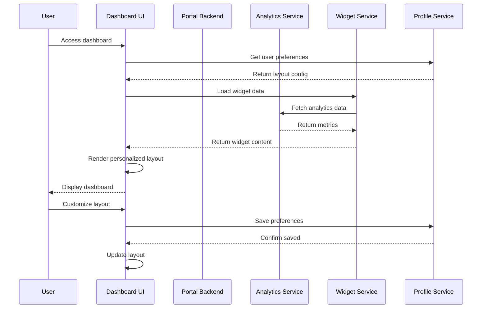
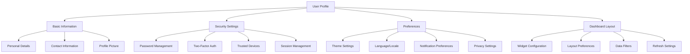

# User Profile and Dashboard Documentation (WBS 1.19)

## Overview

This document provides implementation guidance for user profile management and dashboard UI patterns in the Quantum Safe Privacy Portal. It covers profile customization, dashboard widgets, data visualization, and personalization features that enhance user experience and productivity.

## Architecture Overview

### Dashboard System Flow



### Profile Management Flow



## Implementation Requirements

### Frontend Components

#### 1. Dashboard Framework
```typescript
// src/components/dashboard/Dashboard.tsx
interface DashboardProps {
  layout: DashboardLayout;
  widgets: Widget[];
  onLayoutChange: (layout: DashboardLayout) => void;
  onWidgetAdd: (widget: Widget) => void;
  onWidgetRemove: (widgetId: string) => void;
  onWidgetConfigure: (widgetId: string, config: WidgetConfig) => void;
}

interface DashboardLayout {
  columns: number;
  rows: number;
  widgets: WidgetPosition[];
  theme: string;
  autoRefresh: boolean;
  refreshInterval: number;
}

interface WidgetPosition {
  id: string;
  x: number;
  y: number;
  width: number;
  height: number;
  minWidth?: number;
  minHeight?: number;
}
```

#### 2. Widget System
```typescript
// src/components/dashboard/widgets/Widget.tsx
interface Widget {
  id: string;
  type: WidgetType;
  title: string;
  description?: string;
  config: WidgetConfig;
  data?: any;
  lastUpdated?: Date;
  refreshInterval?: number;
}

enum WidgetType {
  ANALYTICS_CHART = 'analytics_chart',
  DATA_SUMMARY = 'data_summary',
  RECENT_ACTIVITY = 'recent_activity',
  SECURITY_STATUS = 'security_status',
  QUICK_ACTIONS = 'quick_actions',
  NOTIFICATIONS = 'notifications',
  SYSTEM_HEALTH = 'system_health'
}

interface WidgetConfig {
  dataSource?: string;
  chartType?: 'line' | 'bar' | 'pie' | 'doughnut';
  timeRange?: '1h' | '24h' | '7d' | '30d';
  filters?: Record<string, any>;
  displayOptions?: {
    showLegend?: boolean;
    showGrid?: boolean;
    animation?: boolean;
  };
}
```

#### 3. Profile Management Components
```typescript
// src/components/profile/ProfileSettings.tsx
interface ProfileSettingsProps {
  user: User;
  onProfileUpdate: (updates: Partial<User>) => void;
  onPasswordChange: (passwordData: PasswordChangeData) => void;
  onAvatarUpload: (file: File) => void;
}

interface User {
  id: string;
  email: string;
  firstName: string;
  lastName: string;
  avatar?: string;
  preferences: UserPreferences;
  securitySettings: SecuritySettings;
  lastLogin?: Date;
  createdAt: Date;
}

interface UserPreferences {
  theme: 'light' | 'dark' | 'auto';
  language: string;
  timezone: string;
  dateFormat: string;
  notifications: NotificationPreferences;
  dashboard: DashboardPreferences;
}
```

### Backend Components

#### 1. Profile Service
```typescript
// src/profile/profile.service.ts
interface ProfileService {
  getUserProfile(userId: string): Promise<UserProfile>;
  updateProfile(userId: string, updates: Partial<UserProfile>): Promise<UserProfile>;
  uploadAvatar(userId: string, file: Express.Multer.File): Promise<string>;
  updatePreferences(userId: string, preferences: UserPreferences): Promise<void>;
  getDashboardLayout(userId: string): Promise<DashboardLayout>;
  saveDashboardLayout(userId: string, layout: DashboardLayout): Promise<void>;
}
```

#### 2. Dashboard Service
```typescript
// src/dashboard/dashboard.service.ts
interface DashboardService {
  getWidgetData(widgetId: string, config: WidgetConfig): Promise<any>;
  getAvailableWidgets(userId: string): Promise<WidgetDefinition[]>;
  createCustomWidget(userId: string, definition: WidgetDefinition): Promise<Widget>;
  getAnalyticsData(userId: string, timeRange: string): Promise<AnalyticsData>;
  getSystemHealth(): Promise<SystemHealthData>;
}
```

#### 3. Database Schema
```sql
CREATE TABLE user_profiles (
  id UUID PRIMARY KEY,
  user_id UUID NOT NULL REFERENCES users(id),
  first_name VARCHAR(100),
  last_name VARCHAR(100),
  avatar_url VARCHAR(500),
  bio TEXT,
  phone VARCHAR(20),
  timezone VARCHAR(50) DEFAULT 'UTC',
  language VARCHAR(10) DEFAULT 'en',
  date_format VARCHAR(20) DEFAULT 'MM/DD/YYYY',
  created_at TIMESTAMP DEFAULT NOW(),
  updated_at TIMESTAMP DEFAULT NOW()
);

CREATE TABLE user_preferences (
  id UUID PRIMARY KEY,
  user_id UUID NOT NULL REFERENCES users(id),
  theme VARCHAR(20) DEFAULT 'light',
  notifications JSONB DEFAULT '{}',
  dashboard_config JSONB DEFAULT '{}',
  privacy_settings JSONB DEFAULT '{}',
  updated_at TIMESTAMP DEFAULT NOW()
);

CREATE TABLE dashboard_layouts (
  id UUID PRIMARY KEY,
  user_id UUID NOT NULL REFERENCES users(id),
  layout_name VARCHAR(100) DEFAULT 'default',
  layout_config JSONB NOT NULL,
  is_active BOOLEAN DEFAULT true,
  created_at TIMESTAMP DEFAULT NOW(),
  updated_at TIMESTAMP DEFAULT NOW()
);

CREATE TABLE user_widgets (
  id UUID PRIMARY KEY,
  user_id UUID NOT NULL REFERENCES users(id),
  widget_type VARCHAR(50) NOT NULL,
  widget_config JSONB NOT NULL,
  position_x INTEGER NOT NULL,
  position_y INTEGER NOT NULL,
  width INTEGER NOT NULL,
  height INTEGER NOT NULL,
  is_active BOOLEAN DEFAULT true,
  created_at TIMESTAMP DEFAULT NOW()
);
```

## Dashboard Widget Types

### 1. Analytics Chart Widget
```typescript
interface AnalyticsChartWidget extends Widget {
  type: WidgetType.ANALYTICS_CHART;
  config: {
    chartType: 'line' | 'bar' | 'area';
    metrics: string[];
    timeRange: string;
    groupBy?: string;
  };
}
```

### 2. Data Summary Widget
```typescript
interface DataSummaryWidget extends Widget {
  type: WidgetType.DATA_SUMMARY;
  config: {
    summaryType: 'count' | 'size' | 'growth';
    dataSource: string;
    comparisonPeriod?: string;
  };
}
```

### 3. Recent Activity Widget
```typescript
interface RecentActivityWidget extends Widget {
  type: WidgetType.RECENT_ACTIVITY;
  config: {
    activityTypes: string[];
    maxItems: number;
    showTimestamps: boolean;
  };
}
```

### 4. Security Status Widget
```typescript
interface SecurityStatusWidget extends Widget {
  type: WidgetType.SECURITY_STATUS;
  config: {
    securityChecks: string[];
    alertThreshold: 'low' | 'medium' | 'high';
    showRecommendations: boolean;
  };
}
```

## Profile Customization Features

### Personal Information Management
- **Basic Details**: Name, email, phone, bio
- **Avatar Management**: Upload, crop, and manage profile pictures
- **Contact Preferences**: Communication preferences and methods
- **Timezone and Locale**: Regional settings and formatting

### Security Settings
- **Password Management**: Change password, password strength indicators
- **Two-Factor Authentication**: Enable/disable 2FA, backup codes
- **Trusted Devices**: Manage device trust settings
- **Session Management**: Active sessions, logout options
- **Login History**: Recent login activity and locations

### Notification Preferences
```typescript
interface NotificationPreferences {
  email: {
    securityAlerts: boolean;
    systemUpdates: boolean;
    dataProcessing: boolean;
    marketing: boolean;
  };
  inApp: {
    realTimeAlerts: boolean;
    dailySummary: boolean;
    weeklyReports: boolean;
  };
  push: {
    enabled: boolean;
    securityAlerts: boolean;
    systemMaintenance: boolean;
  };
}
```

### Theme and Appearance
- **Color Themes**: Light, dark, auto (system preference)
- **Font Size**: Accessibility options for text scaling
- **Density**: Compact, comfortable, spacious layouts
- **Animation Preferences**: Enable/disable animations

## Implementation Phases

### Phase 1: Basic Profile Management
- [ ] User profile CRUD operations
- [ ] Basic dashboard layout
- [ ] Simple widget system
- [ ] Theme switching

### Phase 2: Advanced Customization
- [ ] Drag-and-drop dashboard
- [ ] Custom widget creation
- [ ] Advanced preferences
- [ ] Avatar management

### Phase 3: Analytics and Insights
- [ ] Personal analytics dashboard
- [ ] Usage insights
- [ ] Performance metrics
- [ ] Recommendation engine

## API Endpoints

### Profile Management
```typescript
// Get user profile
GET /portal/profile

// Update profile information
PUT /portal/profile
{
  "firstName": "John",
  "lastName": "Doe",
  "bio": "Software Engineer",
  "timezone": "America/New_York"
}

// Upload avatar
POST /portal/profile/avatar
Content-Type: multipart/form-data

// Update preferences
PUT /portal/profile/preferences
{
  "theme": "dark",
  "language": "en",
  "notifications": {
    "email": { "securityAlerts": true }
  }
}
```

### Dashboard Management
```typescript
// Get dashboard layout
GET /portal/dashboard/layout

// Save dashboard layout
PUT /portal/dashboard/layout
{
  "columns": 12,
  "widgets": [
    {
      "id": "widget-1",
      "type": "analytics_chart",
      "x": 0, "y": 0, "width": 6, "height": 4
    }
  ]
}

// Get widget data
GET /portal/dashboard/widgets/{widgetId}/data?timeRange=7d

// Get available widgets
GET /portal/dashboard/widgets/available
```

## User Experience Guidelines

### Dashboard UX Principles
- **Customizable**: Users can personalize their dashboard
- **Responsive**: Works across all device sizes
- **Fast Loading**: Optimized for quick data loading
- **Intuitive**: Easy to understand and navigate

### Profile Management UX
- **Progressive Disclosure**: Show relevant options based on context
- **Clear Feedback**: Immediate confirmation of changes
- **Accessibility**: WCAG 2.1 AA compliance
- **Mobile-First**: Optimized for mobile devices

### Widget Design Guidelines
- **Consistent**: Uniform design language across widgets
- **Informative**: Clear data visualization
- **Interactive**: Clickable elements for drill-down
- **Configurable**: User-customizable display options

## Data Visualization

### Chart Types and Use Cases
- **Line Charts**: Time series data, trends
- **Bar Charts**: Comparisons, categorical data
- **Pie Charts**: Proportions, percentages
- **Area Charts**: Volume over time
- **Gauge Charts**: Progress, performance metrics

### Color Schemes
- **Accessible**: High contrast, colorblind-friendly
- **Consistent**: Brand-aligned color palette
- **Semantic**: Colors convey meaning (red=danger, green=success)
- **Themeable**: Adapts to light/dark themes

### Interactive Features
- **Zoom and Pan**: Detailed data exploration
- **Tooltips**: Contextual information on hover
- **Drill-down**: Navigate to detailed views
- **Export**: Download charts as images or data

## Performance Optimization

### Dashboard Loading
- **Lazy Loading**: Load widgets on demand
- **Caching**: Cache widget data and configurations
- **Pagination**: Limit data sets for large datasets
- **Progressive Enhancement**: Core functionality first

### Widget Performance
- **Data Streaming**: Real-time updates for live data
- **Debounced Updates**: Prevent excessive API calls
- **Memory Management**: Cleanup unused components
- **Efficient Rendering**: Virtual scrolling for large lists

## Security Considerations

### Profile Data Protection
- **Data Encryption**: Encrypt sensitive profile data
- **Access Control**: Role-based profile access
- **Audit Logging**: Track profile changes
- **Data Validation**: Sanitize user inputs

### Dashboard Security
- **Widget Permissions**: Control widget access by role
- **Data Filtering**: Show only authorized data
- **XSS Prevention**: Sanitize dynamic content
- **CSRF Protection**: Secure form submissions

## Testing Strategy

### Unit Tests
- Profile service methods
- Widget data processing
- Preference validation
- Dashboard layout logic

### Integration Tests
- Profile update workflows
- Dashboard customization
- Widget data loading
- Theme switching

### E2E Tests
- Complete profile management flow
- Dashboard customization journey
- Cross-browser compatibility
- Mobile responsiveness

## Accessibility Features

### Profile Accessibility
- **Screen Reader Support**: Proper ARIA labels
- **Keyboard Navigation**: Full keyboard accessibility
- **High Contrast**: Support for high contrast themes
- **Text Scaling**: Responsive to browser zoom

### Dashboard Accessibility
- **Widget Focus Management**: Logical tab order
- **Alternative Text**: Descriptive alt text for charts
- **Color Independence**: Information not conveyed by color alone
- **Motion Preferences**: Respect reduced motion settings

## Monitoring and Analytics

### User Engagement Metrics
- Dashboard usage patterns
- Widget popularity
- Customization frequency
- Feature adoption rates

### Performance Metrics
- Dashboard load times
- Widget rendering performance
- API response times
- Error rates

### User Satisfaction
- Profile completion rates
- Customization usage
- Support ticket analysis
- User feedback scores

## Future Enhancements

### Advanced Features
- **AI-Powered Insights**: Personalized recommendations
- **Collaborative Dashboards**: Shared team dashboards
- **Advanced Analytics**: Predictive analytics widgets
- **Voice Control**: Voice-activated dashboard navigation

### Enterprise Features
- **Template Management**: Pre-configured dashboard templates
- **Bulk User Management**: Admin tools for profile management
- **Advanced Reporting**: Custom report generation
- **Integration APIs**: Third-party widget integration

## Dependencies

### Frontend Dependencies
- React Dashboard Library (e.g., react-grid-layout)
- Chart.js or D3.js for visualizations
- Material-UI components
- React Hook Form for forms

### Backend Dependencies
- Image processing library (Sharp)
- File upload middleware (Multer)
- Caching service (Redis)
- Analytics service integration

## Migration Strategy

### Profile Data Migration
- Legacy profile data mapping
- Preference migration scripts
- Avatar image migration
- Gradual feature rollout

### Dashboard Migration
- Default layout creation
- Widget configuration migration
- User training and onboarding
- Feedback collection and iteration

## Compliance Requirements

### Data Privacy
- GDPR compliance for profile data
- User consent for data processing
- Right to data portability
- Data retention policies

### Accessibility Standards
- WCAG 2.1 AA compliance
- Section 508 compliance
- ADA compliance
- International accessibility standards
