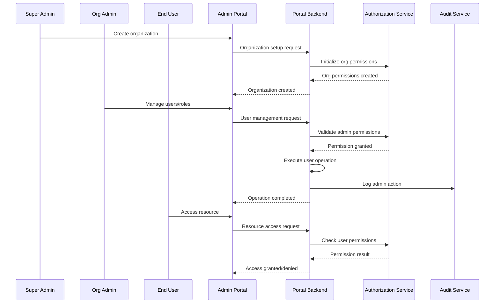

# Enterprise Admin Controls Documentation (WBS 1.17)

## Overview

This document provides implementation guidance for role-based access control (RBAC) and enterprise administration features in the Quantum Safe Privacy Portal. Enterprise admin controls enable organizations to manage users, permissions, security policies, and organizational settings at scale.

## Architecture Overview

### RBAC System Flow



## Implementation Requirements

### Backend Components

#### 1. Role-Based Access Control Service
```typescript
// src/auth/rbac.service.ts
interface RBACService {
  createRole(orgId: string, roleDefinition: RoleDefinition): Promise<Role>;
  assignRole(userId: string, roleId: string, scope?: string): Promise<void>;
  checkPermission(userId: string, resource: string, action: string): Promise<boolean>;
  getUserPermissions(userId: string): Promise<Permission[]>;
  revokeRole(userId: string, roleId: string): Promise<void>;
}
```

#### 2. Organization Management Service
```typescript
// src/admin/organization.service.ts
interface OrganizationService {
  createOrganization(config: OrganizationConfig): Promise<Organization>;
  updateOrganizationSettings(orgId: string, settings: OrgSettings): Promise<void>;
  getOrganizationUsers(orgId: string): Promise<User[]>;
  inviteUser(orgId: string, invitation: UserInvitation): Promise<void>;
  deactivateUser(orgId: string, userId: string): Promise<void>;
}
```

#### 3. Database Schema
```sql
CREATE TABLE organizations (
  id UUID PRIMARY KEY,
  name VARCHAR(255) NOT NULL,
  domain VARCHAR(255) UNIQUE,
  settings JSONB DEFAULT '{}',
  subscription_tier ENUM('basic', 'professional', 'enterprise'),
  max_users INTEGER DEFAULT 100,
  created_at TIMESTAMP DEFAULT NOW(),
  is_active BOOLEAN DEFAULT true
);

CREATE TABLE roles (
  id UUID PRIMARY KEY,
  organization_id UUID REFERENCES organizations(id),
  name VARCHAR(100) NOT NULL,
  description TEXT,
  permissions JSONB NOT NULL,
  is_system_role BOOLEAN DEFAULT false,
  created_at TIMESTAMP DEFAULT NOW()
);

CREATE TABLE user_roles (
  id UUID PRIMARY KEY,
  user_id UUID REFERENCES users(id),
  role_id UUID REFERENCES roles(id),
  organization_id UUID REFERENCES organizations(id),
  scope VARCHAR(255), -- Optional scope limitation
  assigned_by UUID REFERENCES users(id),
  assigned_at TIMESTAMP DEFAULT NOW(),
  expires_at TIMESTAMP,
  is_active BOOLEAN DEFAULT true
);

CREATE TABLE permissions (
  id UUID PRIMARY KEY,
  resource VARCHAR(100) NOT NULL,
  action VARCHAR(100) NOT NULL,
  description TEXT,
  category VARCHAR(50)
);

CREATE TABLE audit_logs (
  id UUID PRIMARY KEY,
  organization_id UUID REFERENCES organizations(id),
  user_id UUID REFERENCES users(id),
  action VARCHAR(100) NOT NULL,
  resource VARCHAR(100),
  details JSONB,
  ip_address INET,
  user_agent TEXT,
  timestamp TIMESTAMP DEFAULT NOW()
);
```

### Frontend Components

#### 1. Organization Dashboard
```typescript
// src/components/admin/OrganizationDashboard.tsx
interface OrganizationDashboardProps {
  organization: Organization;
  userStats: UserStatistics;
  securityMetrics: SecurityMetrics;
  onSettingsUpdate: (settings: OrgSettings) => void;
}
```

#### 2. User Management Interface
```typescript
// src/components/admin/UserManagement.tsx
interface UserManagementProps {
  users: User[];
  roles: Role[];
  onUserInvite: (invitation: UserInvitation) => void;
  onRoleAssign: (userId: string, roleId: string) => void;
  onUserDeactivate: (userId: string) => void;
}
```

#### 3. Role Management Interface
```typescript
// src/components/admin/RoleManagement.tsx
interface RoleManagementProps {
  roles: Role[];
  permissions: Permission[];
  onRoleCreate: (role: RoleDefinition) => void;
  onRoleUpdate: (roleId: string, updates: Partial<Role>) => void;
  onRoleDelete: (roleId: string) => void;
}
```

## Role Definitions

### System Roles

#### Super Administrator
- **Scope**: Global system access
- **Permissions**:
  - Create/manage organizations
  - System configuration
  - Global user management
  - Security policy enforcement
  - Audit log access

#### Organization Administrator
- **Scope**: Organization-wide access
- **Permissions**:
  - User management within organization
  - Role assignment and management
  - Organization settings configuration
  - Security policy management
  - Audit log access for organization

#### Security Administrator
- **Scope**: Security-focused access
- **Permissions**:
  - Security policy configuration
  - Audit log monitoring
  - Incident response management
  - Compliance reporting
  - Security analytics access

#### User Administrator
- **Scope**: User management access
- **Permissions**:
  - User account management
  - Role assignment (limited)
  - User onboarding/offboarding
  - Access request approval
  - User activity monitoring

#### Standard User
- **Scope**: Basic portal access
- **Permissions**:
  - Profile management
  - Data access (own data)
  - Standard portal features
  - Support ticket creation

### Custom Roles
- Department-specific roles
- Project-based access roles
- Temporary access roles
- Integration service roles

## Permission System

### Resource Categories
- **Users**: User account management
- **Roles**: Role and permission management
- **Data**: Data access and management
- **Security**: Security configuration
- **Audit**: Audit log access
- **Settings**: System configuration
- **Reports**: Analytics and reporting

### Action Types
- **Create**: Create new resources
- **Read**: View existing resources
- **Update**: Modify existing resources
- **Delete**: Remove resources
- **Execute**: Perform specific actions
- **Approve**: Approve requests/changes

### Permission Examples
```json
{
  "permissions": [
    {
      "resource": "users",
      "action": "create",
      "scope": "organization"
    },
    {
      "resource": "audit_logs",
      "action": "read",
      "scope": "organization"
    },
    {
      "resource": "security_policies",
      "action": "update",
      "scope": "global"
    }
  ]
}
```

## Implementation Phases

### Phase 1: Basic RBAC
- [ ] Core role and permission system
- [ ] Basic user management
- [ ] Organization structure
- [ ] Simple role assignment

### Phase 2: Advanced Administration
- [ ] Custom role creation
- [ ] Advanced permission scoping
- [ ] Bulk user operations
- [ ] Role templates

### Phase 3: Enterprise Features
- [ ] Automated role provisioning
- [ ] Advanced audit capabilities
- [ ] Compliance reporting
- [ ] Integration APIs

## API Endpoints

### Organization Management
```typescript
// Create organization
POST /portal/admin/organizations
{
  "name": "Acme Corporation",
  "domain": "acme.com",
  "settings": {
    "maxUsers": 500,
    "subscriptionTier": "enterprise"
  }
}

// Get organization users
GET /portal/admin/organizations/{orgId}/users

// Invite user to organization
POST /portal/admin/organizations/{orgId}/users/invite
{
  "email": "user@acme.com",
  "roleId": "uuid",
  "message": "Welcome to our organization"
}
```

### Role Management
```typescript
// Create custom role
POST /portal/admin/roles
{
  "name": "Data Analyst",
  "description": "Access to analytics and reporting",
  "permissions": [
    {"resource": "reports", "action": "read"},
    {"resource": "data", "action": "read"}
  ]
}

// Assign role to user
POST /portal/admin/users/{userId}/roles
{
  "roleId": "uuid",
  "scope": "department:analytics",
  "expiresAt": "2024-12-31T23:59:59Z"
}
```

### Permission Checking
```typescript
// Check user permissions
GET /portal/auth/permissions/check?resource=users&action=create

// Get user's effective permissions
GET /portal/auth/permissions/user/{userId}
```

## Security Features

### Access Control
- Multi-factor authentication for admin actions
- IP address restrictions
- Session timeout policies
- Privileged access monitoring

### Audit and Compliance
- Comprehensive audit logging
- Real-time security monitoring
- Compliance reporting
- Data retention policies

### Privilege Escalation Prevention
- Principle of least privilege
- Regular access reviews
- Automated privilege cleanup
- Separation of duties

## User Experience Guidelines

### Admin Interface UX
- Intuitive role management
- Clear permission visualization
- Bulk operation capabilities
- Search and filtering

### User Onboarding UX
- Streamlined invitation process
- Role-based welcome flows
- Progressive permission disclosure
- Self-service capabilities

## Monitoring and Analytics

### Admin Activity Metrics
- User management operations
- Role assignment patterns
- Permission usage analytics
- Security policy compliance

### Security Monitoring
- Privileged access usage
- Failed authorization attempts
- Unusual admin activity
- Compliance violations

## Compliance Requirements

### Regulatory Compliance
- SOX compliance for financial data
- HIPAA compliance for healthcare
- GDPR compliance for EU users
- Industry-specific regulations

### Security Standards
- ISO 27001 access control
- NIST Cybersecurity Framework
- SOC 2 Type II requirements
- Zero Trust principles

## Testing Strategy

### Unit Tests
- Permission checking logic
- Role assignment validation
- Organization management
- Audit logging

### Integration Tests
- End-to-end admin workflows
- Cross-service permission checks
- Bulk operation testing
- API endpoint validation

### Security Tests
- Privilege escalation attempts
- Authorization bypass testing
- Audit log integrity
- Access control validation

## Future Enhancements

### Advanced Features
- AI-powered role recommendations
- Automated access reviews
- Dynamic permission adjustment
- Risk-based access control

### Enterprise Integration
- Active Directory integration
- SCIM provisioning
- Federated identity management
- Enterprise SSO integration

## Dependencies

### Required Libraries
- Authorization framework
- Audit logging library
- Role management tools
- Compliance reporting tools

### External Services
- Identity providers
- Audit storage services
- Compliance monitoring tools
- Security information systems

## Migration Strategy

### Existing System Migration
- Current permission mapping
- User role migration
- Data preservation
- Gradual rollout plan

### Training and Adoption
- Admin training programs
- User education materials
- Change management process
- Support documentation
