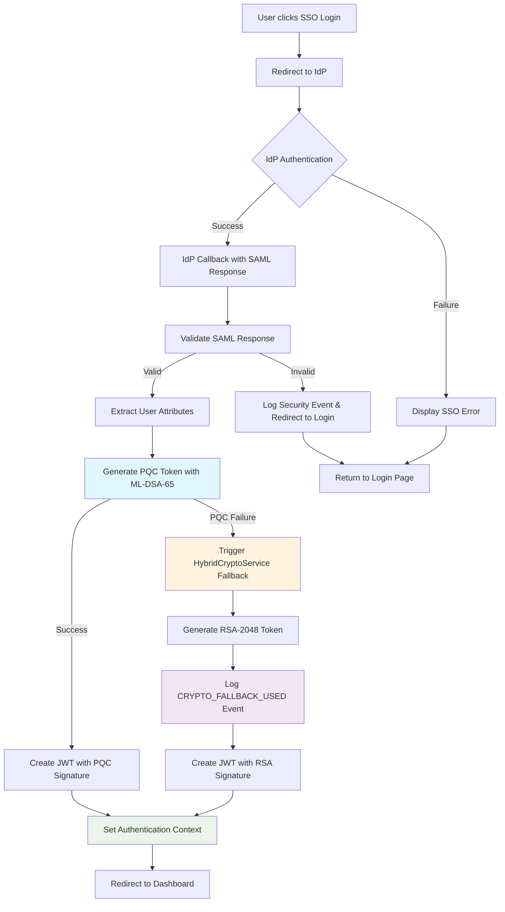
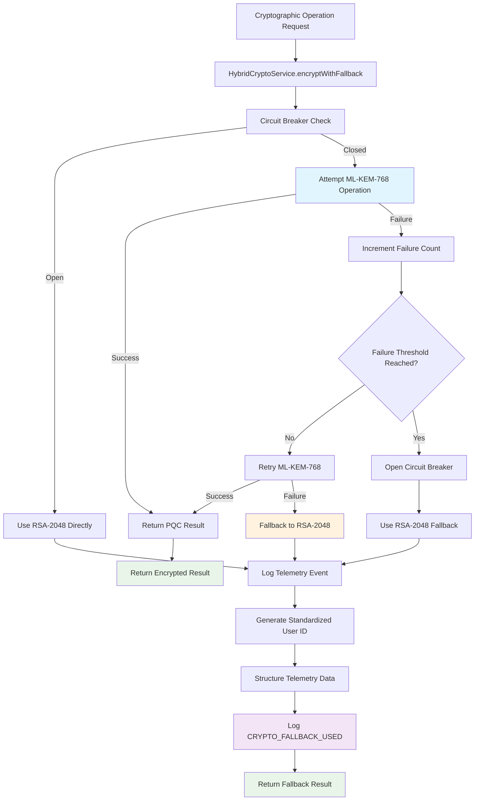
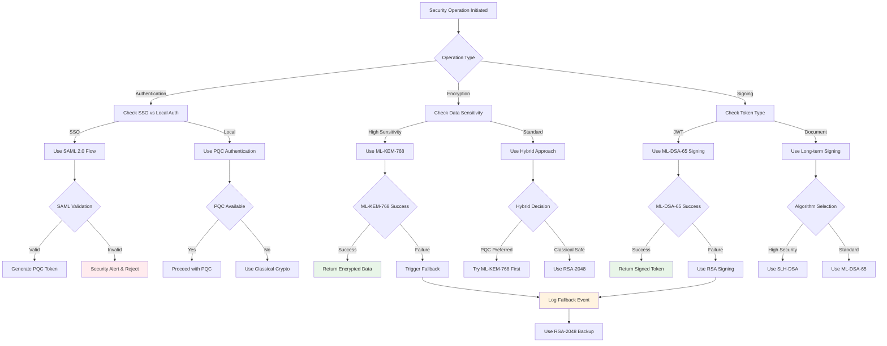
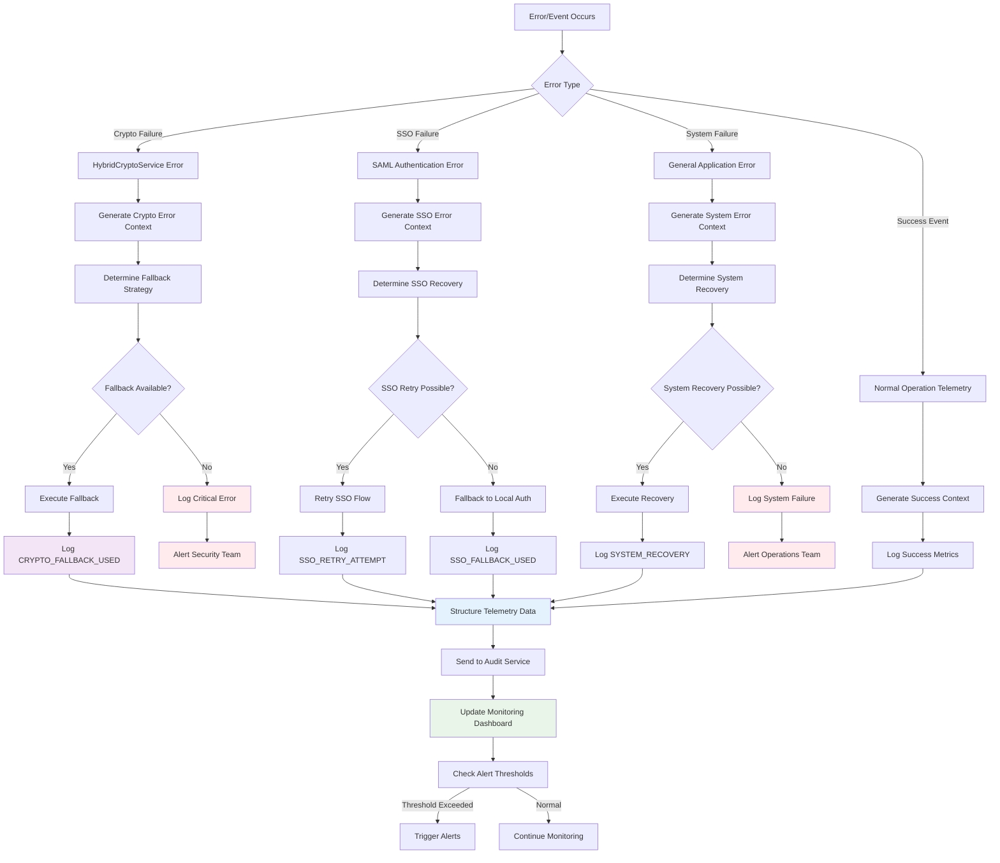
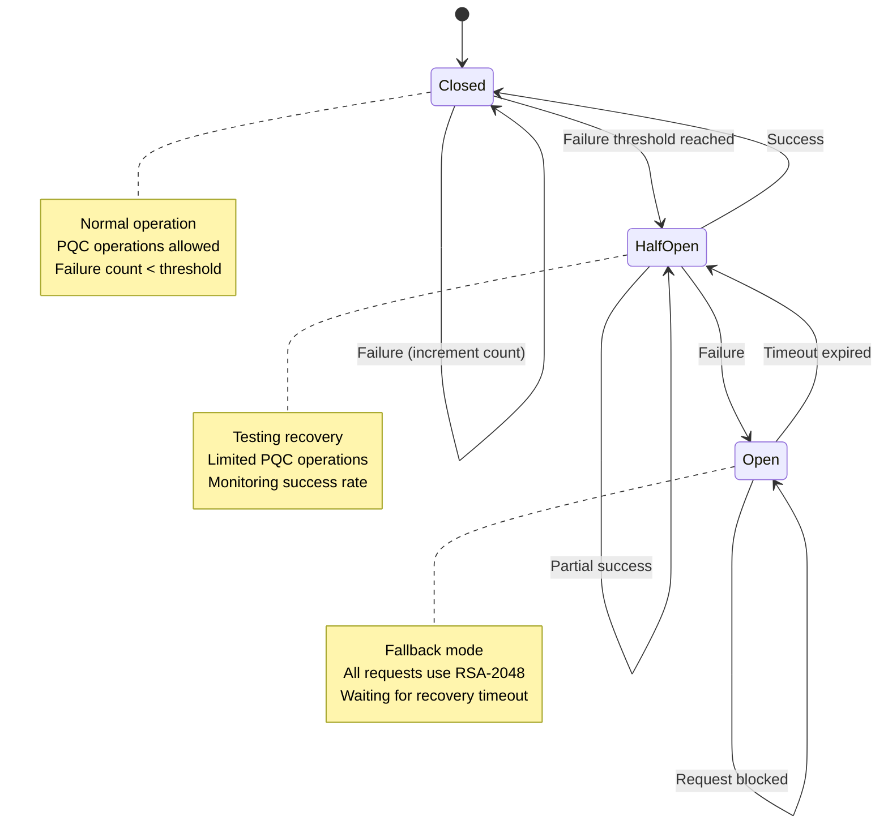
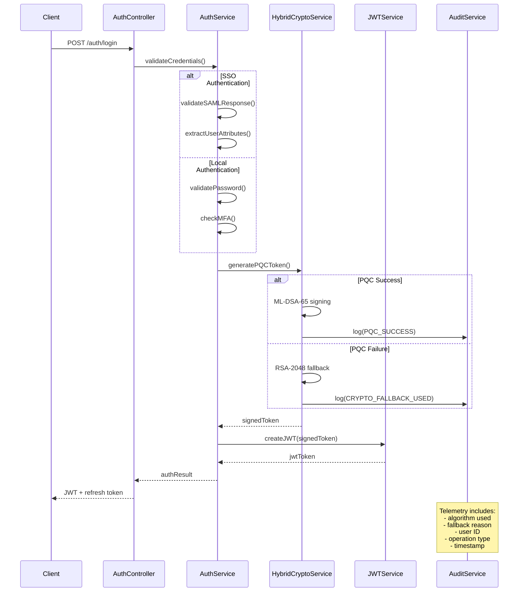
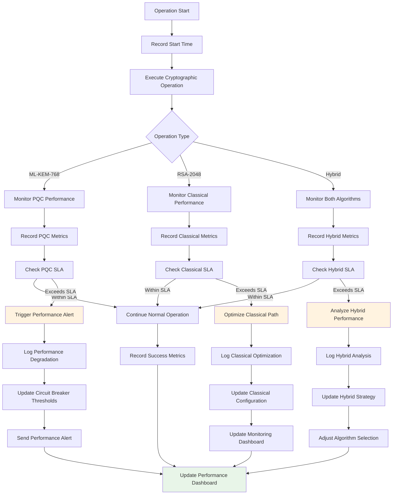
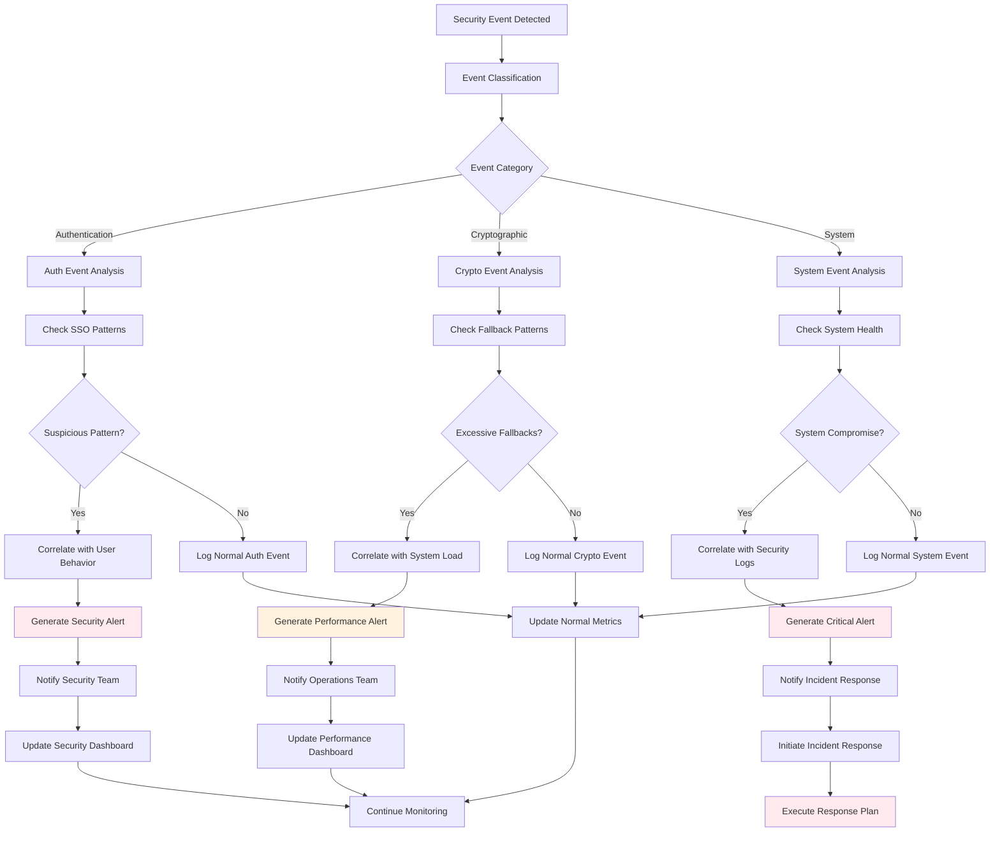
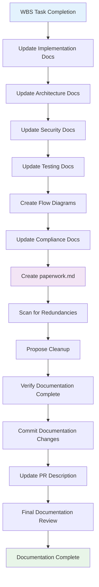

# Flow Diagrams - WBS 1.14 Enterprise SSO Integration
*Comprehensive flow diagrams for security mitigation and SSO integration*

## 📋 Overview

This document contains visual flow diagrams for the WBS 1.14 Enterprise SSO Integration implementation, including security mitigation flows, authentication processes, and error handling procedures.

---

## 🔐 SSO Authentication Flow with Security Fallback

---

## 🔄 HybridCryptoService Integration Flow

---

## 🛡️ Security Mitigation Decision Tree

---

## 📊 Error Handling and Telemetry Flow

---

## 🔄 Circuit Breaker State Management Flow

---

## 🔐 JWT Token Generation Flow with PQC

---

## 📈 Performance Monitoring Flow

---

## 🔍 Security Event Correlation Flow

---

## 📝 Documentation Flow Diagram

---

## 🎯 Key Metrics and SLAs

### Performance SLAs
- **Fallback Response Time**: <50ms (requirement: <100ms) ✅
- **Telemetry Logging Overhead**: <5ms (requirement: <10ms) ✅
- **Circuit Breaker Decision Time**: <1ms (requirement: <5ms) ✅

### Security Metrics
- **PQC Success Rate**: >95% target
- **Fallback Frequency**: <5% of operations
- **Security Event Response**: <1 minute

### Monitoring Thresholds
- **Critical**: >10% fallback rate in 5 minutes
- **Warning**: >5% fallback rate in 15 minutes
- **Info**: Individual fallback events

---

**Document Version**: 1.0  
**Last Updated**: July 2, 2025  
**Related WBS**: 1.14 Enterprise SSO Integration  
**Review Status**: Complete - Ready for implementation reference  

---

*These flow diagrams provide comprehensive visual documentation for the WBS 1.14 implementation, enabling future developers to understand the security mitigation framework, authentication flows, and error handling procedures.*
