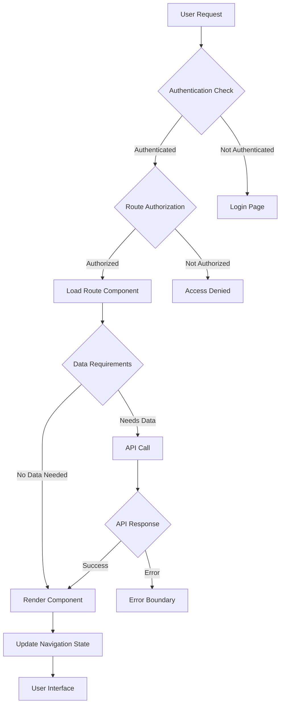

# Routing and Navigation Documentation (WBS 1.18)

## Overview

This document provides implementation guidance for frontend and backend routing patterns in the Quantum Safe Privacy Portal. It covers React Router configuration, API routing patterns, navigation security, and user experience optimization for seamless portal navigation.

## Architecture Overview

### Navigation Flow



### Route Structure

```mermaid
graph LR
    A[Root /] --> B[Public Routes]
    A --> C[Protected Routes]
    A --> D[Admin Routes]
    
    B --> B1[/login]
    B --> B2[/register]
    B --> B3[/forgot-password]
    B --> B4[/sso/callback]
    
    C --> C1[/dashboard]
    C --> C2[/profile]
    C --> C3[/data]
    C --> C4[/settings]
    
    D --> D1[/admin/users]
    D --> D2[/admin/organizations]
    D --> D3[/admin/security]
    D --> D4[/admin/audit]
```

## Implementation Requirements

### Frontend Routing (React Router)

#### 1. Route Configuration
```typescript
// src/routes/AppRoutes.tsx
interface RouteConfig {
  path: string;
  component: React.ComponentType;
  exact?: boolean;
  protected?: boolean;
  roles?: string[];
  permissions?: string[];
  preload?: () => Promise<any>;
}

const routes: RouteConfig[] = [
  // Public routes
  { path: '/login', component: Login, exact: true },
  { path: '/register', component: Register, exact: true },
  { path: '/sso/callback', component: SsoCallback, exact: true },
  
  // Protected routes
  { path: '/dashboard', component: Dashboard, protected: true },
  { path: '/profile', component: Profile, protected: true },
  { path: '/data', component: DataManagement, protected: true },
  
  // Admin routes
  { 
    path: '/admin/users', 
    component: UserManagement, 
    protected: true, 
    roles: ['admin', 'user_admin'] 
  },
  { 
    path: '/admin/security', 
    component: SecuritySettings, 
    protected: true, 
    permissions: ['security:read'] 
  }
];
```

#### 2. Route Guards
```typescript
// src/components/routing/ProtectedRoute.tsx
interface ProtectedRouteProps {
  component: React.ComponentType;
  roles?: string[];
  permissions?: string[];
  fallback?: React.ComponentType;
}

const ProtectedRoute: React.FC<ProtectedRouteProps> = ({
  component: Component,
  roles,
  permissions,
  fallback: Fallback = AccessDenied
}) => {
  const { user, isAuthenticated } = useAuth();
  const navigate = useNavigate();

  if (!isAuthenticated) {
    return <Navigate to="/login" replace />;
  }

  if (roles && !hasAnyRole(user, roles)) {
    return <Fallback />;
  }

  if (permissions && !hasAnyPermission(user, permissions)) {
    return <Fallback />;
  }

  return <Component />;
};
```

#### 3. Navigation Context
```typescript
// src/contexts/NavigationContext.tsx
interface NavigationContextType {
  currentRoute: string;
  breadcrumbs: Breadcrumb[];
  navigationHistory: string[];
  navigateWithAuth: (path: string, options?: NavigationOptions) => void;
  goBack: () => void;
  canGoBack: boolean;
}
```

### Backend Routing (NestJS)

#### 1. API Route Structure
```typescript
// src/app.module.ts
@Module({
  imports: [
    RouterModule.register([
      {
        path: 'portal',
        children: [
          { path: 'auth', module: AuthModule },
          { path: 'users', module: UsersModule },
          { path: 'data', module: DataModule },
          { path: 'admin', module: AdminModule }
        ]
      }
    ])
  ]
})
export class AppModule {}
```

#### 2. Route Guards and Interceptors
```typescript
// src/auth/guards/roles.guard.ts
@Injectable()
export class RolesGuard implements CanActivate {
  constructor(private reflector: Reflector) {}

  canActivate(context: ExecutionContext): boolean {
    const requiredRoles = this.reflector.getAllAndOverride<string[]>(
      'roles',
      [context.getHandler(), context.getClass()]
    );

    if (!requiredRoles) {
      return true;
    }

    const { user } = context.switchToHttp().getRequest();
    return requiredRoles.some(role => user.roles?.includes(role));
  }
}
```

#### 3. API Versioning
```typescript
// src/controllers/users.controller.ts
@Controller({
  path: 'users',
  version: ['1', '2']
})
export class UsersController {
  @Get()
  @Version('1')
  getUsersV1() {
    // Version 1 implementation
  }

  @Get()
  @Version('2')
  getUsersV2() {
    // Version 2 implementation
  }
}
```

## Navigation Patterns

### Hierarchical Navigation
```typescript
// Navigation hierarchy
const navigationStructure = {
  dashboard: {
    title: 'Dashboard',
    icon: 'dashboard',
    children: {
      overview: { title: 'Overview', path: '/dashboard' },
      analytics: { title: 'Analytics', path: '/dashboard/analytics' }
    }
  },
  data: {
    title: 'Data Management',
    icon: 'data',
    children: {
      upload: { title: 'Upload', path: '/data/upload' },
      browse: { title: 'Browse', path: '/data/browse' },
      export: { title: 'Export', path: '/data/export' }
    }
  }
};
```

### Breadcrumb Navigation
```typescript
// src/components/navigation/Breadcrumbs.tsx
interface BreadcrumbItem {
  label: string;
  path: string;
  isActive: boolean;
}

const generateBreadcrumbs = (pathname: string): BreadcrumbItem[] => {
  const pathSegments = pathname.split('/').filter(Boolean);
  return pathSegments.map((segment, index) => ({
    label: formatSegmentLabel(segment),
    path: '/' + pathSegments.slice(0, index + 1).join('/'),
    isActive: index === pathSegments.length - 1
  }));
};
```

### Tab Navigation
```typescript
// src/components/navigation/TabNavigation.tsx
interface TabConfig {
  id: string;
  label: string;
  path: string;
  component: React.ComponentType;
  disabled?: boolean;
  badge?: string | number;
}

const TabNavigation: React.FC<{ tabs: TabConfig[] }> = ({ tabs }) => {
  const location = useLocation();
  const navigate = useNavigate();

  const activeTab = tabs.find(tab => 
    location.pathname.startsWith(tab.path)
  );

  return (
    <Tabs value={activeTab?.id} onChange={handleTabChange}>
      {tabs.map(tab => (
        <Tab
          key={tab.id}
          label={tab.label}
          value={tab.id}
          disabled={tab.disabled}
          icon={tab.badge && <Badge badgeContent={tab.badge} />}
        />
      ))}
    </Tabs>
  );
};
```

## Security Considerations

### Route Protection
- Authentication verification
- Role-based access control
- Permission-based routing
- Session validation

### CSRF Protection
```typescript
// src/middleware/csrf.middleware.ts
@Injectable()
export class CsrfMiddleware implements NestMiddleware {
  use(req: Request, res: Response, next: NextFunction) {
    if (['POST', 'PUT', 'DELETE'].includes(req.method)) {
      const token = req.headers['x-csrf-token'];
      if (!this.validateCsrfToken(token, req.session)) {
        throw new ForbiddenException('Invalid CSRF token');
      }
    }
    next();
  }
}
```

### Rate Limiting
```typescript
// src/guards/rate-limit.guard.ts
@Injectable()
export class RateLimitGuard implements CanActivate {
  constructor(private rateLimiter: RateLimiterService) {}

  async canActivate(context: ExecutionContext): Promise<boolean> {
    const request = context.switchToHttp().getRequest();
    const key = `${request.ip}:${request.route.path}`;
    
    try {
      await this.rateLimiter.consume(key);
      return true;
    } catch {
      throw new TooManyRequestsException('Rate limit exceeded');
    }
  }
}
```

## Performance Optimization

### Code Splitting
```typescript
// src/routes/LazyRoutes.tsx
const Dashboard = lazy(() => import('../pages/Dashboard'));
const Profile = lazy(() => import('../pages/Profile'));
const DataManagement = lazy(() => import('../pages/DataManagement'));

const LazyRoute: React.FC<{ component: React.ComponentType }> = ({ 
  component: Component 
}) => (
  <Suspense fallback={<LoadingSpinner />}>
    <Component />
  </Suspense>
);
```

### Route Preloading
```typescript
// src/utils/routePreloader.ts
class RoutePreloader {
  private preloadedRoutes = new Set<string>();

  preloadRoute(routePath: string) {
    if (this.preloadedRoutes.has(routePath)) return;
    
    const routeConfig = routes.find(route => route.path === routePath);
    if (routeConfig?.preload) {
      routeConfig.preload().then(() => {
        this.preloadedRoutes.add(routePath);
      });
    }
  }

  preloadOnHover(element: HTMLElement, routePath: string) {
    element.addEventListener('mouseenter', () => {
      this.preloadRoute(routePath);
    }, { once: true });
  }
}
```

### Caching Strategies
```typescript
// src/services/routeCache.service.ts
@Injectable()
export class RouteCacheService {
  private cache = new Map<string, any>();

  getCachedData(key: string): any {
    return this.cache.get(key);
  }

  setCachedData(key: string, data: any, ttl: number = 300000) {
    this.cache.set(key, data);
    setTimeout(() => this.cache.delete(key), ttl);
  }

  invalidateCache(pattern: string) {
    for (const key of this.cache.keys()) {
      if (key.includes(pattern)) {
        this.cache.delete(key);
      }
    }
  }
}
```

## Implementation Phases

### Phase 1: Basic Routing
- [ ] Core route configuration
- [ ] Basic authentication guards
- [ ] Simple navigation components
- [ ] Error boundaries

### Phase 2: Advanced Navigation
- [ ] Role-based routing
- [ ] Dynamic breadcrumbs
- [ ] Tab navigation
- [ ] Route preloading

### Phase 3: Performance & Security
- [ ] Code splitting optimization
- [ ] Advanced caching
- [ ] Security hardening
- [ ] Analytics integration

## API Endpoints

### Navigation API
```typescript
// Get navigation structure
GET /portal/navigation/structure

// Get user-specific navigation
GET /portal/navigation/user

// Update navigation preferences
PUT /portal/navigation/preferences
{
  "sidebarCollapsed": true,
  "defaultLandingPage": "/dashboard",
  "favoriteRoutes": ["/data", "/profile"]
}
```

## Testing Strategy

### Route Testing
```typescript
// src/routes/__tests__/AppRoutes.test.tsx
describe('AppRoutes', () => {
  test('redirects unauthenticated users to login', () => {
    render(
      <MemoryRouter initialEntries={['/dashboard']}>
        <AppRoutes />
      </MemoryRouter>
    );
    
    expect(screen.getByText('Login')).toBeInTheDocument();
  });

  test('allows access to protected routes for authenticated users', () => {
    const mockUser = { id: '1', roles: ['user'] };
    
    render(
      <AuthProvider value={{ user: mockUser, isAuthenticated: true }}>
        <MemoryRouter initialEntries={['/dashboard']}>
          <AppRoutes />
        </MemoryRouter>
      </AuthProvider>
    );
    
    expect(screen.getByText('Dashboard')).toBeInTheDocument();
  });
});
```

### Navigation Testing
```typescript
// src/components/navigation/__tests__/Navigation.test.tsx
describe('Navigation', () => {
  test('highlights active route', () => {
    render(
      <MemoryRouter initialEntries={['/dashboard']}>
        <Navigation />
      </MemoryRouter>
    );
    
    const dashboardLink = screen.getByRole('link', { name: 'Dashboard' });
    expect(dashboardLink).toHaveClass('active');
  });
});
```

## User Experience Guidelines

### Navigation UX Principles
- Clear visual hierarchy
- Consistent navigation patterns
- Responsive design
- Accessibility compliance

### Loading States
- Route transition indicators
- Progressive loading
- Skeleton screens
- Error state handling

### Mobile Navigation
- Responsive navigation drawer
- Touch-friendly interactions
- Swipe gestures
- Optimized performance

## Monitoring and Analytics

### Navigation Metrics
- Route usage statistics
- Navigation patterns
- Performance metrics
- Error rates

### User Behavior Analytics
- Most visited routes
- Navigation flow analysis
- Drop-off points
- User journey mapping

## Future Enhancements

### Advanced Features
- AI-powered navigation suggestions
- Personalized navigation
- Voice navigation
- Gesture controls

### Performance Improvements
- Service worker caching
- Predictive preloading
- Edge-side routing
- Progressive web app features

## Dependencies

### Frontend Dependencies
- React Router v6+
- React Suspense
- Material-UI Navigation
- React Query (for data fetching)

### Backend Dependencies
- NestJS Router
- Express middleware
- Rate limiting library
- CSRF protection

## Migration Strategy

### Route Migration
- Legacy route mapping
- Redirect strategies
- Gradual migration plan
- Backward compatibility

### User Training
- Navigation guide
- Feature announcements
- Progressive disclosure
- Help documentation
