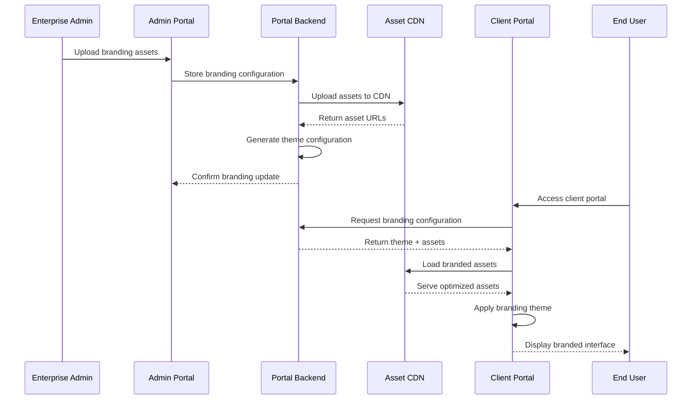

# White Label Branding Documentation (WBS 1.16)

## Overview

This document provides implementation guidance for white-label branding capabilities in the Quantum Safe Privacy Portal. White-label branding enables enterprise clients to customize the portal's appearance, branding, and user experience to match their corporate identity while maintaining the underlying security and functionality.

## Architecture Overview

### Branding System Flow



## Implementation Requirements

### Backend Components

#### 1. Branding Service
```typescript
// src/branding/branding.service.ts
interface BrandingService {
  createBrandingProfile(clientId: string, config: BrandingConfig): Promise<BrandingProfile>;
  updateBrandingAssets(clientId: string, assets: BrandingAssets): Promise<void>;
  getBrandingConfiguration(clientId: string): Promise<BrandingConfig>;
  validateBrandingAssets(assets: BrandingAssets): Promise<ValidationResult>;
  generateThemeCSS(config: BrandingConfig): Promise<string>;
}
```

#### 2. Asset Management
```typescript
interface BrandingAssets {
  logo: {
    primary: File;
    secondary?: File;
    favicon: File;
  };
  colors: {
    primary: string;
    secondary: string;
    accent: string;
    background: string;
    text: string;
  };
  typography: {
    primaryFont: string;
    secondaryFont: string;
    fontWeights: number[];
  };
  customCSS?: string;
}
```

#### 3. Database Schema
```sql
CREATE TABLE branding_profiles (
  id UUID PRIMARY KEY,
  client_id UUID NOT NULL REFERENCES clients(id),
  profile_name VARCHAR(100) NOT NULL,
  logo_primary_url VARCHAR(500),
  logo_secondary_url VARCHAR(500),
  favicon_url VARCHAR(500),
  color_scheme JSONB NOT NULL,
  typography_config JSONB NOT NULL,
  custom_css TEXT,
  theme_css_url VARCHAR(500),
  is_active BOOLEAN DEFAULT true,
  created_at TIMESTAMP DEFAULT NOW(),
  updated_at TIMESTAMP DEFAULT NOW()
);

CREATE TABLE branding_assets (
  id UUID PRIMARY KEY,
  branding_profile_id UUID NOT NULL REFERENCES branding_profiles(id),
  asset_type ENUM('logo', 'favicon', 'background', 'custom'),
  asset_url VARCHAR(500) NOT NULL,
  asset_size INTEGER,
  mime_type VARCHAR(100),
  uploaded_at TIMESTAMP DEFAULT NOW()
);
```

### Frontend Components

#### 1. Branding Configuration Interface
```typescript
// src/components/admin/BrandingConfiguration.tsx
interface BrandingConfigurationProps {
  clientId: string;
  currentBranding?: BrandingProfile;
  onBrandingUpdate: (config: BrandingConfig) => void;
}
```

#### 2. Theme Provider
```typescript
// src/contexts/ThemeContext.tsx
interface ThemeContextProps {
  branding: BrandingConfig;
  applyBranding: (config: BrandingConfig) => void;
  resetToDefault: () => void;
}
```

#### 3. Asset Upload Component
```typescript
// src/components/admin/AssetUpload.tsx
interface AssetUploadProps {
  assetType: 'logo' | 'favicon' | 'background';
  onAssetUploaded: (asset: BrandingAsset) => void;
  validationRules: AssetValidationRules;
}
```

## Branding Customization Options

### Visual Identity
- **Logo Management**: Primary logo, secondary logo, favicon
- **Color Schemes**: Primary, secondary, accent colors
- **Typography**: Font families, weights, sizes
- **Layout Options**: Header styles, navigation layouts
- **Background Elements**: Patterns, gradients, images

### Content Customization
- **Application Name**: Custom portal name
- **Welcome Messages**: Personalized onboarding content
- **Footer Content**: Custom links, copyright information
- **Help Documentation**: Branded support materials
- **Email Templates**: Branded notification emails

### Advanced Customization
- **Custom CSS**: Advanced styling overrides
- **Component Themes**: Branded UI components
- **Animation Preferences**: Custom transitions and effects
- **Responsive Breakpoints**: Mobile-specific branding
- **Dark/Light Mode**: Theme variants

## Implementation Phases

### Phase 1: Basic Branding
- [ ] Logo and favicon upload
- [ ] Color scheme customization
- [ ] Basic typography options
- [ ] Application name customization

### Phase 2: Advanced Styling
- [ ] Custom CSS support
- [ ] Component theme system
- [ ] Responsive branding
- [ ] Email template branding

### Phase 3: Enterprise Features
- [ ] Multi-brand management
- [ ] Brand approval workflows
- [ ] Usage analytics
- [ ] Brand compliance monitoring

## API Endpoints

### Branding Management
```typescript
// Upload branding assets
POST /portal/admin/branding/assets
Content-Type: multipart/form-data
{
  "assetType": "logo",
  "file": File,
  "clientId": "uuid"
}

// Update branding configuration
PUT /portal/admin/branding/config/{clientId}
{
  "colors": {
    "primary": "#1976d2",
    "secondary": "#dc004e"
  },
  "typography": {
    "primaryFont": "Roboto",
    "secondaryFont": "Open Sans"
  }
}

// Get branding configuration
GET /portal/branding/config/{clientId}

// Generate theme CSS
POST /portal/branding/generate-theme/{clientId}
```

## Asset Management

### File Upload Requirements
- **Logo Files**: PNG, SVG, JPEG (max 2MB)
- **Favicon**: ICO, PNG (16x16, 32x32, 48x48)
- **Background Images**: PNG, JPEG (max 5MB)
- **Custom Fonts**: WOFF, WOFF2, TTF (max 1MB each)

### CDN Integration
- Automatic asset optimization
- Global content delivery
- Cache invalidation strategies
- Asset versioning

### Asset Validation
- File size limits
- Image dimension requirements
- Color contrast validation
- Accessibility compliance

## Theme Generation

### CSS Variable System
```css
:root {
  --brand-primary: #1976d2;
  --brand-secondary: #dc004e;
  --brand-accent: #ff9800;
  --brand-background: #ffffff;
  --brand-text: #333333;
  --brand-font-primary: 'Roboto', sans-serif;
  --brand-font-secondary: 'Open Sans', sans-serif;
}
```

### Component Theming
- Material-UI theme integration
- Custom component styling
- Responsive design tokens
- Animation configurations

### Theme Compilation
- SCSS/CSS preprocessing
- Asset URL injection
- Minification and optimization
- Cache busting

## User Experience Guidelines

### Branding Interface UX
- Intuitive asset upload flow
- Real-time preview capabilities
- Undo/redo functionality
- Brand guideline compliance

### Client Portal UX
- Seamless brand application
- Fast loading times
- Consistent branding across pages
- Mobile-responsive branding

## Quality Assurance

### Brand Validation
- Logo quality checks
- Color accessibility validation
- Typography readability tests
- Cross-browser compatibility

### Performance Testing
- Asset loading performance
- Theme application speed
- Mobile optimization
- CDN effectiveness

### User Acceptance Testing
- Brand consistency verification
- Usability testing
- Accessibility compliance
- Client feedback integration

## Security Considerations

### Asset Security
- File type validation
- Malware scanning
- Size limit enforcement
- Content security policies

### Access Control
- Role-based branding permissions
- Client isolation
- Asset access restrictions
- Audit logging

## Monitoring and Analytics

### Usage Metrics
- Branding adoption rates
- Asset usage statistics
- Theme performance metrics
- User engagement with branded elements

### Quality Metrics
- Brand consistency scores
- Accessibility compliance rates
- Performance impact measurements
- Client satisfaction ratings

## Compliance Requirements

### Accessibility Standards
- WCAG 2.1 AA compliance
- Color contrast requirements
- Screen reader compatibility
- Keyboard navigation support

### Brand Guidelines
- Logo usage guidelines
- Color palette restrictions
- Typography standards
- Layout consistency rules

## Future Enhancements

### Advanced Features
- AI-powered brand suggestions
- Automated accessibility fixes
- Dynamic theme generation
- Brand performance optimization

### Enterprise Features
- Multi-tenant brand management
- Brand approval workflows
- Usage rights management
- Brand asset libraries

## Dependencies

### Required Libraries
- Image processing library
- CSS preprocessing tools
- CDN integration SDK
- Theme generation engine

### External Services
- Content delivery network
- Image optimization service
- Font delivery service
- Asset storage service

## Migration Strategy

### Existing Client Migration
- Automated brand detection
- Gradual rollout process
- Fallback mechanisms
- Client communication plan

### Data Migration
- Asset transfer procedures
- Configuration mapping
- Validation processes
- Rollback capabilities
