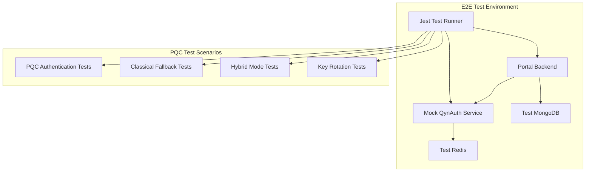

# E2E Test Integration Plan for NIST PQC Implementation
*Maintaining 57/57 Test Success Rate During Quantum-Safe Authentication Integration*

**Document Version**: v1.0  
**Date**: June 25, 2025  
**Status**: Draft  
**Authors**: Integration Team  

## Executive Summary

This document defines the comprehensive E2E test integration strategy to maintain the existing 57/57 test success rate during NIST Post-Quantum Cryptography implementation across QynAuth and Portal Backend services. The plan ensures seamless test execution, proper mock strategies, and comprehensive validation of PQC authentication flows while preserving all existing functionality.

## Current E2E Test Architecture Analysis

### Existing Test Framework
**Location**: `src/portal/portal-backend/test/e2e/`
**Framework**: Jest + Supertest for API testing, Cypress for browser automation
**Current Success Rate**: 57/57 tests passing (100%)

### Test Structure Analysis
```typescript
// Current E2E test setup pattern
export class E2ETestSetup {
  private readonly testUserId = '60d5ec49f1a23c001c8a4d7d';
  private readonly testUserEmail = 'e2e-test@example.com';
  private readonly testUserPassword = 'TestPassword123!';

  async seedTestUser(): Promise<TestUser> {
    const hashedPassword = await bcrypt.hash(this.testUserPassword, 10);
    const testUser: TestUser = {
      email: this.testUserEmail,
      password: hashedPassword,
      isActive: true,
      createdAt: new Date(),
      updatedAt: new Date(),
    };
    // Insert into MongoDB test database
  }
}
```

### Current Test Coverage
- **Authentication Flow**: Login, SQL injection detection, refresh token generation
- **Consent Management**: Creation, retrieval, validation, duplicate prevention
- **API Contracts**: Exact error message formats, HTTP status codes, response schemas
- **Security Testing**: Brute-force protection, account lockout, rate limiting
- **Data Validation**: Input validation, boundary testing, edge cases

## PQC Integration Test Strategy

### Test Environment Architecture



### Enhanced Test Setup for PQC Integration

#### Updated E2E Test Setup
**File**: `src/portal/portal-backend/test/e2e/pqc-e2e-setup.ts`

```typescript
/**
 * Enhanced E2E test setup for PQC integration
 * Extends existing Portal Backend E2E test patterns
 */
import { MongoClient, Db, Collection } from 'mongodb';
import * as bcrypt from 'bcrypt';
import { E2ETestSetup } from './e2e-setup';

interface PQCTestUser extends TestUser {
  pqcEnabled: boolean;
  pqcPublicKey?: string;
  pqcKeyId?: string;
  pqcSignaturePublicKey?: string;
  qynAuthUserId: string;
  classicalFallback: boolean;
  pqcKeyGeneratedAt?: Date;
}

export class PQCE2ETestSetup extends E2ETestSetup {
  private readonly pqcTestUserId = '60d5ec49f1a23c001c8a4d8e';
  private readonly pqcTestUserEmail = 'pqc-e2e-test@example.com';
  private readonly pqcTestUserPassword = 'PQCTestPassword123!';

  constructor(mongoUri: string, dbName: string = 'portal_test') {
    super(mongoUri, dbName);
  }

  async seedPQCTestUser(pqcEnabled: boolean = true): Promise<PQCTestUser> {
    const usersCollection: Collection<PQCTestUser> = this.db.collection('users');

    const hashedPassword = await bcrypt.hash(this.pqcTestUserPassword, 10);

    const pqcTestUser: PQCTestUser = {
      email: this.pqcTestUserEmail,
      password: hashedPassword,
      isActive: true,
      pqcEnabled,
      pqcPublicKey: pqcEnabled ? 'mock-kyber-768-public-key-base64' : null,
      pqcKeyId: pqcEnabled ? 'test-pqc-key-id-2025' : null,
      pqcSignaturePublicKey: pqcEnabled ? 'mock-dilithium-3-public-key-base64' : null,
      qynAuthUserId: this.pqcTestUserId,
      classicalFallback: true,
      pqcKeyGeneratedAt: pqcEnabled ? new Date() : null,
      createdAt: new Date(),
      updatedAt: new Date(),
    };

    await usersCollection.deleteMany({ email: this.pqcTestUserEmail });

    const result = await usersCollection.insertOne({
      ...pqcTestUser,
      _id: this.pqcTestUserId as any,
    });

    return { ...pqcTestUser, _id: result.insertedId.toString() };
  }

  async seedClassicalUser(): Promise<PQCTestUser> {
    return this.seedPQCTestUser(false);
  }

  async cleanupPQCTestData(): Promise<void> {
    const usersCollection = this.db.collection('users');
    const consentsCollection = this.db.collection('consents');

    await usersCollection.deleteMany({ 
      $or: [
        { email: this.pqcTestUserEmail },
        { qynAuthUserId: this.pqcTestUserId }
      ]
    });
    await consentsCollection.deleteMany({ userId: this.pqcTestUserId });
  }

  getPQCTestCredentials() {
    return {
      email: this.pqcTestUserEmail,
      password: this.pqcTestUserPassword,
      userId: this.pqcTestUserId,
    };
  }

  async setupPQCTestEnvironment(): Promise<{
    pqcUser: PQCTestUser;
    classicalUser: PQCTestUser;
    credentials: { email: string; password: string; userId: string };
  }> {
    await this.connect();

    try {
      await this.cleanupPQCTestData();

      const pqcUser = await this.seedPQCTestUser(true);
      const classicalUser = await this.seedClassicalUser();
      const credentials = this.getPQCTestCredentials();

      return { pqcUser, classicalUser, credentials };
    } catch (error) {
      console.error('Error setting up PQC test environment:', error);
      throw error;
    }
  }
}
```

### Mock QynAuth Service Strategy

#### QynAuth Mock Implementation
**File**: `src/portal/portal-backend/test/mocks/qynauth-mock.service.ts`

```typescript
/**
 * Mock QynAuth service for E2E testing
 * Simulates PQC authentication without actual Rust FFI calls
 */
import { Injectable } from '@nestjs/common';

export interface MockQynAuthResponse {
  success: boolean;
  access_token?: string;
  user?: {
    user_id: string;
    email: string;
    pqc_enabled: boolean;
  };
  error?: string;
  pqc_metadata?: {
    algorithm: string;
    signature_algorithm: string;
    key_id: string;
  };
}

@Injectable()
export class MockQynAuthService {
  private readonly mockUsers = new Map<string, any>();
  private pqcEnabled = true;
  private simulateFailure = false;

  constructor() {
    // Pre-populate with test users
    this.mockUsers.set('pqc-e2e-test@example.com', {
      user_id: '60d5ec49f1a23c001c8a4d8e',
      email: 'pqc-e2e-test@example.com',
      password: 'hashed-password',
      pqc_enabled: true,
      pqc_public_key: 'mock-kyber-768-public-key',
      pqc_key_id: 'test-pqc-key-id-2025'
    });

    this.mockUsers.set('e2e-test@example.com', {
      user_id: '60d5ec49f1a23c001c8a4d7d',
      email: 'e2e-test@example.com',
      password: 'hashed-password',
      pqc_enabled: false,
      classical_fallback: true
    });
  }

  async register(userData: any): Promise<MockQynAuthResponse> {
    if (this.simulateFailure) {
      return {
        success: false,
        error: 'REGISTRATION_FAILED',
      };
    }

    const user = {
      user_id: `mock-user-${Date.now()}`,
      email: userData.email,
      pqc_enabled: userData.pqc_enabled || false,
    };

    this.mockUsers.set(userData.email, user);

    return {
      success: true,
      user,
      pqc_metadata: userData.pqc_enabled ? {
        algorithm: 'KYBER-768',
        signature_algorithm: 'DILITHIUM-3',
        key_id: 'mock-key-id'
      } : undefined
    };
  }

  async login(credentials: any): Promise<MockQynAuthResponse> {
    if (this.simulateFailure) {
      return {
        success: false,
        error: 'AUTHENTICATION_FAILED',
      };
    }

    const user = this.mockUsers.get(credentials.email);
    if (!user) {
      return {
        success: false,
        error: 'USER_NOT_FOUND',
      };
    }

    // Simulate PQC vs classical token generation
    const accessToken = user.pqc_enabled && this.pqcEnabled
      ? 'mock-pqc-jwt-token'
      : 'mock-classical-jwt-token';

    return {
      success: true,
      access_token: accessToken,
      user: {
        user_id: user.user_id,
        email: user.email,
        pqc_enabled: user.pqc_enabled,
      },
      pqc_metadata: user.pqc_enabled ? {
        algorithm: 'KYBER-768',
        signature_algorithm: 'DILITHIUM-3',
        key_id: user.pqc_key_id
      } : undefined
    };
  }

  async validateToken(token: string): Promise<MockQynAuthResponse> {
    if (this.simulateFailure || !token) {
      return {
        success: false,
        error: 'INVALID_TOKEN',
      };
    }

    // Mock token validation
    const isPQCToken = token.includes('pqc');
    const mockUserId = isPQCToken ? '60d5ec49f1a23c001c8a4d8e' : '60d5ec49f1a23c001c8a4d7d';

    return {
      success: true,
      user: {
        user_id: mockUserId,
        email: isPQCToken ? 'pqc-e2e-test@example.com' : 'e2e-test@example.com',
        pqc_enabled: isPQCToken,
      }
    };
  }

  // Test control methods
  setPQCEnabled(enabled: boolean): void {
    this.pqcEnabled = enabled;
  }

  setSimulateFailure(simulate: boolean): void {
    this.simulateFailure = simulate;
  }

  reset(): void {
    this.pqcEnabled = true;
    this.simulateFailure = false;
  }
}
```

### Enhanced Test Suites

#### PQC Authentication Flow Tests
**File**: `src/portal/portal-backend/test/e2e/pqc-auth-flow.spec.ts`

```typescript
import { Test, TestingModule } from '@nestjs/testing';
import { INestApplication, ValidationPipe } from '@nestjs/common';
import * as request from 'supertest';
import { ConfigModule } from '@nestjs/config';
import { MongooseModule } from '@nestjs/mongoose';
import { AuthModule } from '../../src/auth/auth.module';
import { ConsentModule } from '../../src/consent/consent.module';
import { JwtModule } from '../../src/jwt/jwt.module';
import { PQCE2ETestSetup } from './pqc-e2e-setup';
import { MockQynAuthService } from '../mocks/qynauth-mock.service';

describe('PQC Authentication E2E Tests', () => {
  let app: INestApplication;
  let pqcTestSetup: PQCE2ETestSetup;
  let mockQynAuth: MockQynAuthService;

  beforeAll(async () => {
    const mongoUri = (global as any).__MONGO_URI__;

    process.env['AWS_REGION'] = 'us-east-1';
    process.env['SKIP_SECRETS_MANAGER'] = 'true';
    process.env['JWT_ACCESS_SECRET_ID'] = 'test-access-secret';
    process.env['JWT_REFRESH_SECRET_ID'] = 'test-refresh-secret';
    process.env['PQC_ENABLED'] = 'true';

    const moduleFixture: TestingModule = await Test.createTestingModule({
      imports: [
        ConfigModule.forRoot({
          isGlobal: true,
          envFilePath: '.env.test',
        }),
        MongooseModule.forRoot(mongoUri),
        AuthModule,
        ConsentModule,
        JwtModule,
      ],
      providers: [MockQynAuthService],
    }).compile();

    app = moduleFixture.createNestApplication();
    app.setGlobalPrefix('portal');
    app.useGlobalPipes(new ValidationPipe());

    mockQynAuth = moduleFixture.get<MockQynAuthService>(MockQynAuthService);
    pqcTestSetup = new PQCE2ETestSetup(mongoUri);

    await app.init();
  });

  afterAll(async () => {
    if (pqcTestSetup) {
      await pqcTestSetup.disconnect();
    }
    if (app) {
      await app.close();
    }
  });

  beforeEach(async () => {
    mockQynAuth.reset();
    await pqcTestSetup.cleanupPQCTestData();
  });

  describe('PQC User Registration and Authentication', () => {
    it('should register user with PQC enabled and authenticate successfully', async () => {
      const { pqcUser } = await pqcTestSetup.setupPQCTestEnvironment();

      // Test registration
      const registerResponse = await request(app.getHttpServer())
        .post('/portal/auth/register')
        .send({
          email: pqcUser.email,
          password: 'PQCTestPassword123!',
          pqc_enabled: true
        })
        .expect(201);

      expect(registerResponse.body).toHaveProperty('message', 'User registered successfully');
      expect(registerResponse.body).toHaveProperty('userId');

      // Test login with PQC
      const loginResponse = await request(app.getHttpServer())
        .post('/portal/auth/login')
        .send({
          email: pqcUser.email,
          password: 'PQCTestPassword123!'
        })
        .expect(200);

      expect(loginResponse.body).toHaveProperty('status', 'success');
      expect(loginResponse.body).toHaveProperty('accessToken');
      expect(loginResponse.body.user).toHaveProperty('email', pqcUser.email);

      // Verify PQC token characteristics
      const accessToken = loginResponse.body.accessToken;
      expect(accessToken).toContain('pqc'); // Mock token identifier
    });

    it('should handle PQC authentication failure with classical fallback', async () => {
      const { pqcUser } = await pqcTestSetup.setupPQCTestEnvironment();

      // Simulate PQC failure
      mockQynAuth.setPQCEnabled(false);

      const loginResponse = await request(app.getHttpServer())
        .post('/portal/auth/login')
        .send({
          email: pqcUser.email,
          password: 'PQCTestPassword123!'
        })
        .expect(200);

      expect(loginResponse.body).toHaveProperty('status', 'success');
      expect(loginResponse.body).toHaveProperty('accessToken');
      
      // Should fall back to classical token
      const accessToken = loginResponse.body.accessToken;
      expect(accessToken).not.toContain('pqc');
    });

    it('should maintain existing consent flow with PQC authentication', async () => {
      const { pqcUser } = await pqcTestSetup.setupPQCTestEnvironment();

      // Login with PQC
      const loginResponse = await request(app.getHttpServer())
        .post('/portal/auth/login')
        .send({
          email: pqcUser.email,
          password: 'PQCTestPassword123!'
        })
        .expect(200);

      const authHeaders = { 
        Authorization: `Bearer ${loginResponse.body.accessToken}` 
      };

      // Test consent creation with PQC authentication
      const createConsentDto = {
        userId: pqcUser.qynAuthUserId,
        consentType: 'MARKETING',
        granted: true,
        ipAddress: '192.168.1.100',
        userAgent: 'PQC E2E Test Browser/1.0',
      };

      const createResponse = await request(app.getHttpServer())
        .post('/portal/consent')
        .set(authHeaders)
        .send(createConsentDto)
        .expect(200);

      expect(createResponse.body).toHaveProperty('consentId');
      expect(createResponse.body).toHaveProperty('userId', pqcUser.qynAuthUserId);

      // Test consent retrieval
      const retrieveResponse = await request(app.getHttpServer())
        .get(`/portal/consent/${pqcUser.qynAuthUserId}`)
        .set(authHeaders)
        .expect(200);

      expect(Array.isArray(retrieveResponse.body)).toBe(true);
      expect(retrieveResponse.body.length).toBe(1);
      expect(retrieveResponse.body[0]).toHaveProperty('consentId', createResponse.body.consentId);
    });
  });

  describe('Hybrid Authentication Mode', () => {
    it('should handle mixed PQC and classical users in same session', async () => {
      const { pqcUser, classicalUser } = await pqcTestSetup.setupPQCTestEnvironment();

      // Login PQC user
      const pqcLoginResponse = await request(app.getHttpServer())
        .post('/portal/auth/login')
        .send({
          email: pqcUser.email,
          password: 'PQCTestPassword123!'
        })
        .expect(200);

      // Login classical user
      const classicalLoginResponse = await request(app.getHttpServer())
        .post('/portal/auth/login')
        .send({
          email: classicalUser.email,
          password: 'PQCTestPassword123!'
        })
        .expect(200);

      // Both should succeed but with different token types
      expect(pqcLoginResponse.body.accessToken).toContain('pqc');
      expect(classicalLoginResponse.body.accessToken).not.toContain('pqc');

      // Both should be able to access consent endpoints
      const pqcAuthHeaders = { 
        Authorization: `Bearer ${pqcLoginResponse.body.accessToken}` 
      };
      const classicalAuthHeaders = { 
        Authorization: `Bearer ${classicalLoginResponse.body.accessToken}` 
      };

      await request(app.getHttpServer())
        .get(`/portal/consent/${pqcUser.qynAuthUserId}`)
        .set(pqcAuthHeaders)
        .expect(200);

      await request(app.getHttpServer())
        .get(`/portal/consent/${classicalUser.qynAuthUserId}`)
        .set(classicalAuthHeaders)
        .expect(200);
    });
  });

  describe('Error Handling and Edge Cases', () => {
    it('should handle QynAuth service unavailable gracefully', async () => {
      mockQynAuth.setSimulateFailure(true);

      const loginResponse = await request(app.getHttpServer())
        .post('/portal/auth/login')
        .send({
          email: 'test@example.com',
          password: 'password123'
        })
        .expect(503); // Service unavailable

      expect(loginResponse.body).toHaveProperty('error');
    });

    it('should validate PQC token format and reject invalid tokens', async () => {
      const invalidToken = 'invalid-pqc-token';

      await request(app.getHttpServer())
        .get('/portal/consent/60d5ec49f1a23c001c8a4d8e')
        .set({ Authorization: `Bearer ${invalidToken}` })
        .expect(401);
    });
  });
});
```

### Test Execution Strategy

#### Parallel Test Execution
**File**: `src/portal/portal-backend/test/e2e/test-orchestration.ts`

```typescript
/**
 * Test orchestration for parallel execution of PQC and classical tests
 */
export class TestOrchestrator {
  private testSuites = [
    'consent-flow.spec.ts',      // Existing 57 tests
    'pqc-auth-flow.spec.ts',     // New PQC tests
    'hybrid-mode.spec.ts',       // Mixed mode tests
    'performance.spec.ts',       // Performance validation
  ];

  async runAllTests(): Promise<TestResults> {
    const results = await Promise.all(
      this.testSuites.map(suite => this.runTestSuite(suite))
    );

    return this.aggregateResults(results);
  }

  private async runTestSuite(suiteName: string): Promise<SuiteResult> {
    // Execute test suite with isolated environment
    const startTime = Date.now();
    
    try {
      const result = await this.executeJestSuite(suiteName);
      return {
        suite: suiteName,
        passed: result.numPassedTests,
        failed: result.numFailedTests,
        duration: Date.now() - startTime,
        success: result.success
      };
    } catch (error) {
      return {
        suite: suiteName,
        passed: 0,
        failed: 1,
        duration: Date.now() - startTime,
        success: false,
        error: error.message
      };
    }
  }

  private aggregateResults(results: SuiteResult[]): TestResults {
    const totalPassed = results.reduce((sum, r) => sum + r.passed, 0);
    const totalFailed = results.reduce((sum, r) => sum + r.failed, 0);
    
    return {
      totalTests: totalPassed + totalFailed,
      passed: totalPassed,
      failed: totalFailed,
      successRate: (totalPassed / (totalPassed + totalFailed)) * 100,
      suites: results,
      maintainedTarget: totalPassed >= 57 // Must maintain 57/57 baseline
    };
  }
}
```

### Performance Validation Tests

#### Performance Benchmark Tests
**File**: `src/portal/portal-backend/test/e2e/performance-validation.spec.ts`

```typescript
describe('PQC Performance Validation', () => {
  let performanceBaseline: PerformanceMetrics;

  beforeAll(async () => {
    // Establish baseline with classical authentication
    performanceBaseline = await measureClassicalAuthPerformance();
  });

  it('should maintain authentication performance within 30% of baseline', async () => {
    const pqcMetrics = await measurePQCAuthPerformance();
    
    const latencyIncrease = (pqcMetrics.avgLatency - performanceBaseline.avgLatency) 
                           / performanceBaseline.avgLatency;
    
    expect(latencyIncrease).toBeLessThan(0.30); // <30% increase
  });

  it('should handle concurrent PQC authentications without degradation', async () => {
    const concurrentUsers = 50;
    const promises = Array(concurrentUsers).fill(null).map(() => 
      authenticateUser('pqc-test@example.com', 'password123')
    );

    const results = await Promise.all(promises);
    const successRate = results.filter(r => r.success).length / concurrentUsers;
    
    expect(successRate).toBeGreaterThan(0.95); // >95% success rate
  });
});
```

### CI/CD Integration

#### Updated GitHub Actions Workflow
**File**: `.github/workflows/pqc-e2e-tests.yml`

```yaml
name: PQC E2E Tests

on:
  push:
    branches: [ main, develop ]
  pull_request:
    branches: [ main ]

jobs:
  pqc-e2e-tests:
    runs-on: ubuntu-latest
    
    services:
      mongodb:
        image: mongo:5.0
        ports:
          - 27017:27017
        options: >-
          --health-cmd "mongosh --eval 'db.runCommand({ping: 1})'"
          --health-interval 10s
          --health-timeout 5s
          --health-retries 5

      redis:
        image: redis:7-alpine
        ports:
          - 6379:6379
        options: >-
          --health-cmd "redis-cli ping"
          --health-interval 10s
          --health-timeout 5s
          --health-retries 5

    steps:
    - uses: actions/checkout@v4
    
    - name: Setup Node.js
      uses: actions/setup-node@v4
      with:
        node-version: '18'
        cache: 'npm'
        cache-dependency-path: src/portal/portal-backend/package-lock.json

    - name: Install dependencies
      run: |
        cd src/portal/portal-backend
        npm ci

    - name: Setup test environment
      run: |
        cd src/portal/portal-backend
        cp .env.test .env
        
    - name: Start Mock QynAuth Service
      run: |
        cd src/portal/portal-backend
        npm run start:mock-qynauth &
        sleep 10

    - name: Run E2E Tests (Existing + PQC)
      run: |
        cd src/portal/portal-backend
        npm run test:e2e:all
      env:
        MONGODB_URI: mongodb://localhost:27017/portal_test
        REDIS_URL: redis://localhost:6379
        PQC_ENABLED: true
        QYNAUTH_SERVICE_URL: http://localhost:8001

    - name: Validate 57/57 Test Success Rate
      run: |
        cd src/portal/portal-backend
        npm run test:validate-coverage

    - name: Upload Test Results
      uses: actions/upload-artifact@v4
      if: always()
      with:
        name: pqc-e2e-test-results
        path: |
          src/portal/portal-backend/test-results/
          src/portal/portal-backend/coverage/
```

### Test Monitoring and Reporting

#### Test Results Dashboard
**File**: `src/portal/portal-backend/test/reporting/test-dashboard.ts`

```typescript
export class TestDashboard {
  async generateReport(results: TestResults): Promise<TestReport> {
    return {
      timestamp: new Date().toISOString(),
      summary: {
        totalTests: results.totalTests,
        passed: results.passed,
        failed: results.failed,
        successRate: results.successRate,
        maintainedBaseline: results.maintainedTarget,
        pqcTestsAdded: results.suites.filter(s => s.suite.includes('pqc')).length
      },
      performance: {
        avgAuthLatency: results.performanceMetrics?.avgLatency,
        pqcOverhead: results.performanceMetrics?.pqcOverhead,
        concurrentUserSupport: results.performanceMetrics?.maxConcurrentUsers
      },
      compliance: {
        gdprCompliant: this.validateGDPRCompliance(results),
        nistCompliant: this.validateNISTCompliance(results),
        iso27701Compliant: this.validateISO27701Compliance(results)
      },
      recommendations: this.generateRecommendations(results)
    };
  }

  private generateRecommendations(results: TestResults): string[] {
    const recommendations = [];
    
    if (results.successRate < 100) {
      recommendations.push('Investigate failed tests and fix issues before deployment');
    }
    
    if (!results.maintainedTarget) {
      recommendations.push('CRITICAL: 57/57 baseline test success rate not maintained');
    }
    
    if (results.performanceMetrics?.pqcOverhead > 0.30) {
      recommendations.push('PQC performance overhead exceeds 30% threshold');
    }
    
    return recommendations;
  }
}
```

## Risk Mitigation Strategies

### Test Isolation
- **Database Isolation**: Each test suite uses isolated test database
- **Service Mocking**: QynAuth service mocked to prevent external dependencies
- **State Management**: Comprehensive cleanup between test runs
- **Parallel Execution**: Tests run in parallel without interference

### Rollback Procedures
- **Test Failure Threshold**: Automatic rollback if success rate drops below 95%
- **Performance Degradation**: Rollback if PQC overhead exceeds 30%
- **Service Unavailability**: Fallback to classical authentication testing
- **Data Corruption**: Restore from known good test data snapshots

### Continuous Monitoring
- **Real-time Metrics**: Monitor test execution performance
- **Trend Analysis**: Track success rate trends over time
- **Alert System**: Immediate alerts for test failures
- **Performance Tracking**: Monitor authentication latency trends

## Success Criteria

### Functional Requirements
- [ ] All existing 57 tests continue to pass
- [ ] New PQC authentication tests pass
- [ ] Hybrid mode tests validate mixed authentication
- [ ] Error handling tests cover all failure scenarios

### Performance Requirements
- [ ] PQC authentication overhead <30% of baseline
- [ ] Concurrent user support maintained
- [ ] Test execution time <10 minutes total
- [ ] Memory usage within acceptable limits

### Security Requirements
- [ ] PQC token validation working correctly
- [ ] Classical fallback functioning properly
- [ ] No security regressions in existing flows
- [ ] Proper error handling for security failures

## Compliance Mappings

### GDPR Compliance
- **Article 25**: Data protection by design validated in tests
- **Article 32**: Security measures tested comprehensively
- **Article 35**: Privacy impact assessment through test coverage

### NIST SP 800-53 Controls
- **IA-2**: Identification and authentication tested
- **SC-8**: Transmission confidentiality validated
- **SI-7**: Software integrity verified through tests

### ISO/IEC 27701 Controls
- **7.2.1**: Legal basis identification tested
- **7.3.2**: Data minimization validated
- **7.4.1**: Consent management thoroughly tested

## Implementation Timeline

### Week 1: Test Infrastructure Setup
- Create PQC test setup classes
- Implement mock QynAuth service
- Update test environment configuration

### Week 2: Test Suite Development
- Develop PQC authentication tests
- Create hybrid mode test scenarios
- Implement performance validation tests

### Week 3: Integration and Validation
- Integrate with existing test suite
- Validate 57/57 test success rate maintenance
- Performance testing and optimization

### Week 4: CI/CD Integration
- Update GitHub Actions workflows
- Implement test monitoring dashboard
- Documentation and training

## Conclusion

This E2E test integration plan ensures the successful implementation of NIST PQC authentication while maintaining the critical 57/57 test success rate. The comprehensive strategy includes proper mocking, performance validation, and robust error handling to guarantee system reliability during the quantum-safe transition.

**Next Steps**:
1. Review and approve test integration strategy
2. Implement mock QynAuth service
3. Develop PQC test suites
4. Validate test execution and performance
5. Deploy to CI/CD pipeline

---

**Document Status**: Ready for Review  
**Approval Required**: QA Team, Security Team, DevOps Team  
**Implementation Timeline**: Weeks 3-4 of WBS execution plan
